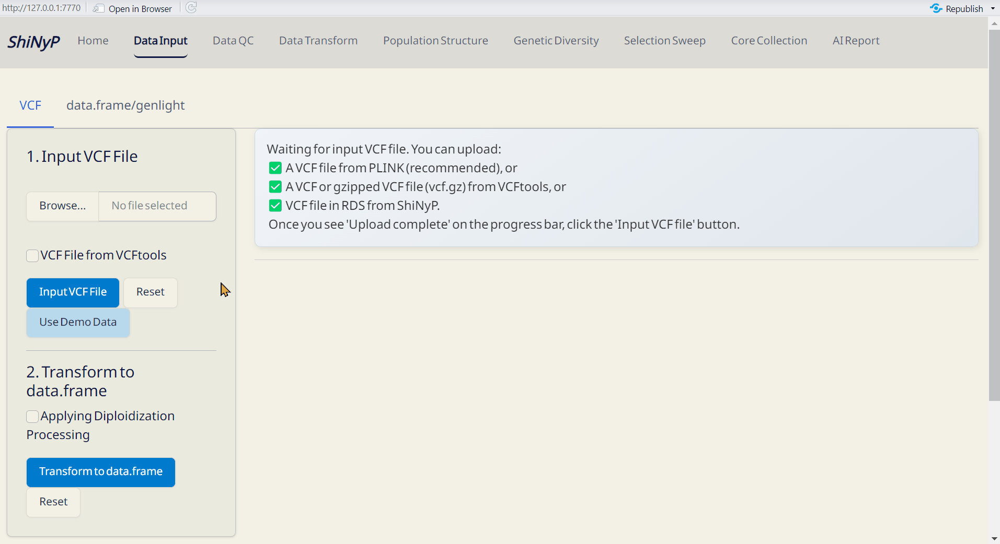
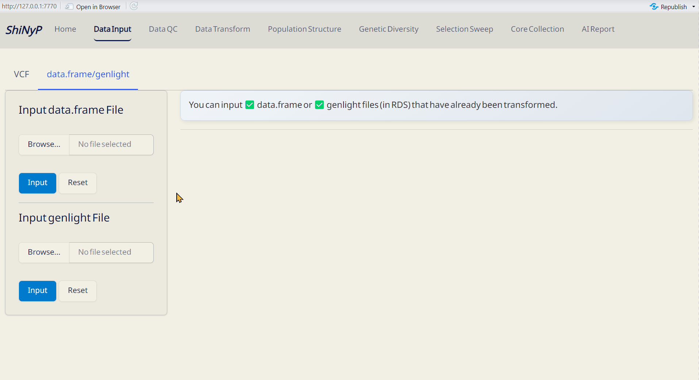

# Data Input {#sec-data-input}

```{=html}
<!-- Google tag (gtag.js) -->
<script async src="https://www.googletagmanager.com/gtag/js?id=G-2662B66TL7"></script>
<script>
  window.dataLayer = window.dataLayer || [];
  function gtag(){dataLayer.push(arguments);}
  gtag('js', new Date());

  gtag('config', 'G-2662B66TL7');
</script>
```

::: {style="background-color: #7c6f41; color: white; padding: 10px 5px; margin: 10px 0px; border-radius: 15px;"}
| ➡️ This section includes two subpages: [VCF]{.underline} and [data.frame/genlight]{.underline}, allowing you to upload and work with different data formats for analysis.
:::

{width="6.8in"}

------------------------------------------------------------------------

## VCF

#### Required File: {.unnumbered style="padding: 0px 5px; margin: 0px 10px"}

*ShiNyP* accepts VCF files in the following formats:

-   VCF file from [PLINK](https://www.cog-genomics.org/plink/)
-   VCF or gzipped VCF (vcf.gz) file from
    [VCFtools](https://vcftools.sourceforge.net/man_latest.html)
-   VCF file in RDS format previously saved by *ShiNyP*

> **Note:** The VCF file should contain SNPs' chromosome and position
> information in the first two columns
> ([**`#CHROM`**]{style="color: #8b0000;"} and
> [**`POS`**]{style="color: #8b0000;"}), along with sample names and
> their genotypic information. For some whole genome sequencing (WGS)
> data, where SNP markers' IDs are missing, *ShiNyP* will auto-generate
> the SNP ID names as [#CHROM:POS]{.underline}, such as
> [2:12500]{.underline}, indicating chromosome 2, position 12500.

------------------------------------------------------------------------

#### Step 1: Upload VCF File {.unnumbered style="padding: 0px 5px; margin: 0px 10px"}

1.  Click Browse to select and upload your VCF file.
2.  If your file was generated using VCFtools, make sure to check the
    "VCF file from VCFtools" option.
3.  After the progress bar shows 'Upload complete', click [Input VCF
    File]{style="color: #fff;background-color: #007ACC;"} to proceed.

*Or Use Demo Data*

1.  Click [Use Demo
    Data]{style="color: #fff;background-color: #007ACC;"} and choose a
    species from the list.
2.  For details about the demo datasets, visit:
    <https://github.com/TeddYenn/ShiNyP/tree/main/inst/demo_data>.

> **Note:** By default, the interactive table will display genotype data
> for 5 samples and 10 SNPs as a preview.

------------------------------------------------------------------------

#### Step 2: Transform to data.frame {.unnumbered style="padding: 0px 5px; margin: 0px 10px"}

1.  After uploading your VCF file, click [Transform to
    data.frame]{style="color: #fff;background-color: #007ACC;"}.
2.  Download the generated *data.frame* and Site Info (both in RDS
    format) to skip VCF upload next time by directly importing these
    files.

> **Note:** *ShiNyP* is optimized for genome-wide SNP analysis in
> diploid species. For haploid or polyploid data, please the check
> "Applying diploidization processing" option. *This approach simplifies
> genotype data and does not account for allelic dosage effects.*

------------------------------------------------------------------------

#### Outputs: {.unnumbered style="padding: 0px 5px; margin: 0px 10px"}

-   VCF Data (RDS): Raw VCF data in RDS format, readable in R.
-   *data.frame* (RDS): Contains genotypic data — required for
    downstream analysis.
-   Site Info. (RDS): Contains SNP site information — required for
    downstream analysis.

> **Note:** For large datasets (\>1GB), processing may take time.
> *ShiNyP* handles one task at a time — please wait for each step to
> complete before proceeding.

{width="6.8in"}

------------------------------------------------------------------------

<br>

## data.frame/genlight

#### Required File: {.unnumbered style="padding: 0px 5px; margin: 0px 10px"}

-   *data.frame* in RDS format
-   *genlight* in RDS format
-   *genind* in RDS format

> | **Note:** *data.frame* available on subpages such as [VCF]{.underline}, [Sample QC]{.underline}, [SNP QC]{.underline}, [Core Sample Set]{.underline}, or [Core SNP Set]{.underline}.
> | *genlight* and *genind* available on [Data Transform]{.underline} page.

------------------------------------------------------------------------

#### Step 1: Upload File {.unnumbered style="padding: 0px 5px; margin: 0px 10px"}

Browse and select your file, then click
[Input]{style="color: #fff;background-color: #007ACC;"} to upload.

{width="6.8in"}

------------------------------------------------------------------------