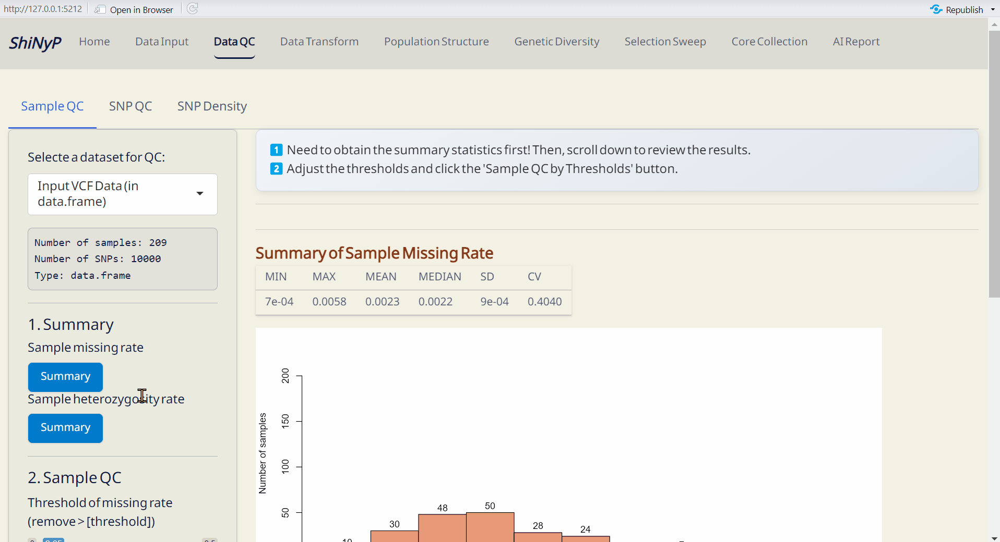

# Data QC {#sec-data-qc}

```{=html}
<!-- Google tag (gtag.js) -->
<script async src="https://www.googletagmanager.com/gtag/js?id=G-2662B66TL7"></script>
<script>
  window.dataLayer = window.dataLayer || [];
  function gtag(){dataLayer.push(arguments);}
  gtag('js', new Date());

  gtag('config', 'G-2662B66TL7');
</script>
```

::: {style="background-color: #7c6f41; color: white; padding: 10px 5px; margin: 10px 0px; border-radius: 15px;"}
| ➡️ This section includes three subpages: [Sample QC]{.underline}, [SNP QC]{.underline}, and [SNP Density]{.underline}, allowing you to assess the quality of samples and SNPs in *data.frame*, as well as visualize SNP density across the genome.
:::

## Sample QC

#### Required File: {.unnumbered style="padding: 0px 5px; margin: 0px 10px"}

-   *data.frame* file from the [Data Input]{.underline} page or
-   SNP post-QC *data.frame* file from the [Data QC]{.underline}/[SNP
    QC]{.underline} subpage .

------------------------------------------------------------------------

#### Step 1: Get Summary {.unnumbered style="padding: 0px 5px; margin: 0px 10px"}

First, obtain the sample summary statistics (missing rate and
heterozygosity rate) by clicking both
[Summary]{style="color: #fff;background-color: #007ACC;"} buttons and
you will see the results.

------------------------------------------------------------------------

#### Step 2: Sample QC {.unnumbered style="padding: 0px 5px; margin: 0px 10px"}

Adjust the thresholds and click [Sample QC by
Thresholds]{style="color: #fff;background-color: #007ACC;"}. This will
generate the Post-QC *data.frame* file.

> **Note:** If you prefer not to perform sample QC by sample missing
> rate or heterozygosity rate, please set the threshold to 1.

------------------------------------------------------------------------

#### Outputs: {.unnumbered style="padding: 0px 5px; margin: 0px 10px"}

-   *data.frame* (RDS): Updated *data.frame* file — required for
    downstream analysis.
-   Site Info. (RDS): Updated SNP site information file — required for
    downstream analysis.

{width="6.8in"}

------------------------------------------------------------------------

<br>

## SNP QC

#### Required File: {.unnumbered style="padding: 0px 5px; margin: 0px 10px"}

-   *data.frame* file from the [Data Input]{.underline} page or
-   Sample post-QC *data.frame* file from the [Data
    QC]{.underline}/[Sample QC]{.underline} subpage.

------------------------------------------------------------------------

#### Step 1: Get Summary {.unnumbered style="padding: 0px 5px; margin: 0px 10px"}

First, obtain the SNP summary statistics [missing rate, minor allele
frequency (MAF), heterozygosity rate, and Hardy-Weinberg equilibrium
(HWE)] by clicking all
[Summary]{style="color: #fff;background-color: #007ACC;"} buttons and
you will see the results.

------------------------------------------------------------------------

#### Step 2: Sample QC {.unnumbered style="padding: 0px 5px; margin: 0px 10px"}

Adjust the thresholds and click [SNP QC by
Thresholds]{style="color: #fff;background-color: #007ACC;"}. This will
generate the Post-QC *data.frame* file.

> **Note:** If you prefer not to perform QC based on SNP missing rate or
> heterozygosity rate, set the missing rate threshold to 1, the MAF to
> 0, and the heterozygosity rate to 0 and 1. Also, leave the 'Do SNP QC
> by HWE' checkbox unticked to skip QC based on SNP HWE.

------------------------------------------------------------------------

#### Outputs: {.unnumbered}

-   *data.frame* (RDS): Updated *data.frame* file — required for
    downstream analysis.
-   Site Info. (RDS): Updated SNP site information file — required for
    downstream analysis.

{width="6.8in"}

------------------------------------------------------------------------

## SNP Density

#### Required Files: {.unnumbered style="padding: 0px 5px; margin: 0px 10px"}

-   Site Info. (RDS) of the current *data.frame*, downloadable from
    [Data Input]{.underline} or [Data QC]{.underline} pages.

-   Chromosome Info. (CSV): Reference genome information of the current
    study.

    <a class="btn btn-primary" href="assets/Chromosome_Info.csv" download>
    *Download an example of Chromosome Info. (CSV).*</a>

    This file should contain three columns: "Chr", "Start", and "End".

    -   "Chr" column should specify the chromosome names (as characters,
        e.g., "Chr01", "Chr11")
    -   "End" column should indicate the length of each chromosome
        (numeric)
    -   "Start" column can be set to 0 or 1 for each chromosome.

------------------------------------------------------------------------

#### Steps: {.unnumbered style="padding: 0px 5px; margin: 0px 10px"}

1.  Upload Site Info. (RDS) and Chromosome Info. (CSV).
2.  Choose a window size in kilobases (kb).
3.  Click [Summary]{style="color: #fff;background-color: #007ACC;"}.

------------------------------------------------------------------------

#### Outputs: {.unnumbered style="padding: 0px 5px; margin: 0px 10px"}

-   SNP Density Plot (PDF): An ideogram visualizing SNP density across
    the genome within a defined window size. A gradient color palette is
    used to represent varying SNP densities: *green* for [lower
    densities]{.underline}, *yellow* for [medium densities]{.underline},
    and *red* for [higher densities]{.underline}, with *grey* indicating
    regions with [zero SNP]{.underline}.
-   SNP Density (CSV): A table detailing SNP density across each
    chromosome. *bp_over_SNPs*: The total base pairs (bp) per SNP in
    each window, representing the average spacing between SNPs.
    *SNPs_over_1000bp*: The number of SNPs per 1,000 base pairs,
    providing a normalized measure of SNP density across the genome.

{width="6.8in" height="3.7in"}

------------------------------------------------------------------------
