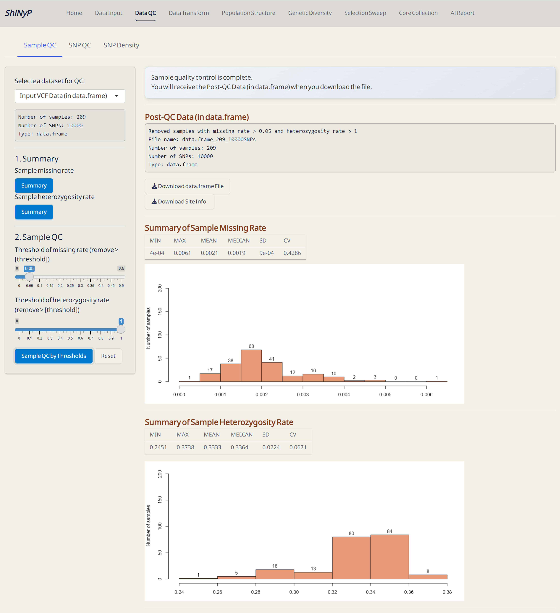
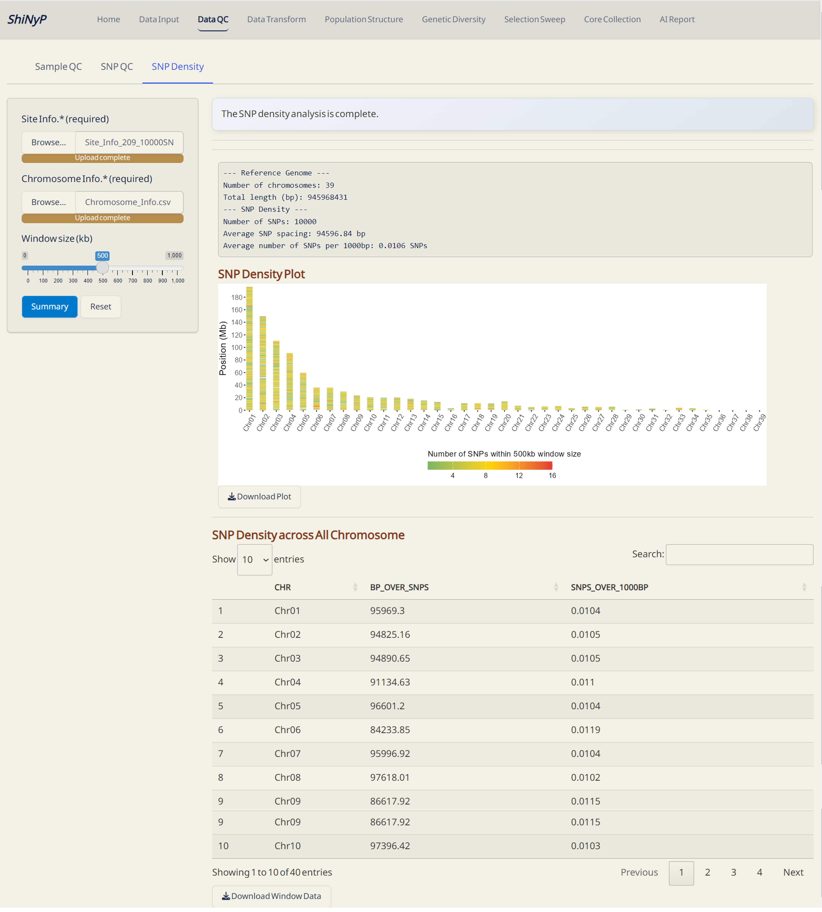

# Data QC {#sec-data-qc}

```{=html}
<!-- Google tag (gtag.js) -->
<script async src="https://www.googletagmanager.com/gtag/js?id=G-2662B66TL7"></script>
<script>
  window.dataLayer = window.dataLayer || [];
  function gtag(){dataLayer.push(arguments);}
  gtag('js', new Date());

  gtag('config', 'G-2662B66TL7');
</script>
```

::: {style="background-color: #7c6f41; color: white; padding: 10px 5px; margin: 10px 0px; border-radius: 15px;"}
➡️ This section contains three subpages: [**Sample QC**]{.underline},
[**SNP QC**]{.underline}, and [**SNP Density**]{.underline}, allowing
you to assess the quality of samples and SNPs in **data.frame**, as well
as visualize SNP density across the genome.
:::

## Sample QC

#### Required Dataset (one of the following): {.unnumbered style="padding: 0px 5px; margin: 0px 10px"}

-   [**`data.frame`**]{style="color: #8b0000;"} file from the [Data
    Input]{.underline} page

-   SNP post-QC [**`data.frame`**]{style="color: #8b0000;"} file from
    the subpage [Data QC]{.underline}/[SNP QC]{.underline}

------------------------------------------------------------------------

#### Step 1: Get Summary {.unnumbered style="padding: 0px 5px; margin: 0px 10px"}

First, obtain the sample summary statistics (missing rate and
heterozygosity rate) by clicking both
[**Summary**]{style="color: #fff;background-color: #007ACC;"} buttons
and you will see the results.

------------------------------------------------------------------------

#### Step 2: Sample QC {.unnumbered style="padding: 0px 5px; margin: 0px 10px"}

Adjust the thresholds and click the [**Sample QC by
Thresholds**]{style="color: #fff;background-color: #007ACC;"} button.
This will generate the Post-QC
[**`data.frame`**]{style="color: #8b0000;"} file.

> **Note:** If you prefer not to perform sample QC by sample missing
> rate or heterozygosity rate, please set the threshold to 0.

------------------------------------------------------------------------

#### Outputs: {.unnumbered style="padding: 0px 5px; margin: 0px 10px"}

-   **data.frame (RDS)**: Updated
    [**`data.frame`**]{style="color: #8b0000;"} file. It's necessary for
    downstream analyses, *please download and save it!*

-   **Site Info. (RDS)**: Updated SNP site information file. It's
    necessary for downstream analyses, *please download and save it!*

{width="650"}

*Sample QC Complete!*

------------------------------------------------------------------------

## SNP QC

#### Required Dataset (one of the following): {.unnumbered style="padding: 0px 5px; margin: 0px 10px"}

-   [**`data.frame`**]{style="color: #8b0000;"} file from the [Data
    Input]{.underline} page

-   Sample post-QC [**`data.frame`**]{style="color: #8b0000;"} file from
    the subpage [Data QC]{.underline}/[Sample QC]{.underline}

------------------------------------------------------------------------

#### Step 1: Get Summary {.unnumbered style="padding: 0px 5px; margin: 0px 10px"}

First, obtain the SNP summary statistics [missing rate, minor allele
frequency (MAF), heterozygosity rate, and Hardy-Weinberg equilibrium
(HWE)] by clicking all
[**Summary**]{style="color: #fff;background-color: #007ACC;"} buttons
and you will see the results.

------------------------------------------------------------------------

#### Step 2: Sample QC {.unnumbered style="padding: 0px 5px; margin: 0px 10px"}

Adjust the thresholds and click the [**SNP QC by
Thresholds**]{style="color: #fff;background-color: #007ACC;"} button.
This will generate the Post-QC
[**`data.frame`**]{style="color: #8b0000;"} file.

> **Note:** If you prefer not to perform QC based on SNP missing rate or
> heterozygosity rate, set the missing rate threshold to 1, the MAF to
> 0, and the heterozygosity rate to 0 and 1. Additionally, leave the 'Do
> SNP QC by HWE' checkbox unticked to skip QC based on SNP HWE.

------------------------------------------------------------------------

#### Outputs: {.unnumbered}

-   **data.frame (RDS)**: Updated
    [**`data.frame`**]{style="color: #8b0000;"} file. It's necessary for
    downstream analyses, *please download and save it!*

-   **Site Info. (RDS)**: Updated SNP site information file. It's
    necessary for downstream analyses, *please download and save it!*

{width="650"}

*SNP QC Complete!*

------------------------------------------------------------------------

## SNP Density

#### Required Dataset (one of the following): {.unnumbered style="padding: 0px 5px; margin: 0px 10px"}

-   **Site Info.** **(RDS)** of the current **`data.frame`**,
    downloadable from [Data Input]{.underline} or [Data QC]{.underline}
    pages.

-   **Chromosome Info.** **(CSV)**: Reference genome information of the
    current study.

    <a href="https://drive.google.com/file/d/1gIEba13YizQ14IU8gPYj8q57C3urTUpa/view?usp=drive_link" target="_blank">***Click
    here***</a>*: Download an example of **Chromosome Info.(CSV)**.*

<details>

<summary>➡️ Example: **Chromosome Info.** of rice (Data source:
<a href="https://www.ncbi.nlm.nih.gov/datasets/genome/GCF_034140825.1/" target="_blank"><https://www.ncbi.nlm.nih.gov/datasets/genome/GCF_034140825.1/></a>)</summary>

| Chr   | Start | End      |
|-------|-------|----------|
| Chr01 | 0     | 43929697 |
| Chr02 | 0     | 36447916 |
| Chr03 | 0     | 37399924 |
| Chr04 | 0     | 36078568 |
| Chr05 | 0     | 30400764 |
| Chr06 | 0     | 32122276 |
| Chr07 | 0     | 29936421 |
| Chr08 | 0     | 28605474 |
| Chr09 | 0     | 27474823 |
| Chr10 | 0     | 23931887 |
| Chr11 | 0     | 31111469 |
| Chr12 | 0     | 28271460 |

</details>

------------------------------------------------------------------------

#### Steps: {.unnumbered style="padding: 0px 5px; margin: 0px 10px"}

1.  [Upload]{style="background-color: #fceed2;"} **Site Info.**
    **(RDS)** and **Chromosome Info. (CSV)**.

2.  Choose a window size in kilobases (kb).

3.  Click the
    [**Summary**]{style="color: #fff;background-color: #007ACC;"}
    button. This will calculate the density of SNPs across the genome.

------------------------------------------------------------------------

#### Outputs: {.unnumbered style="padding: 0px 5px; margin: 0px 10px"}

-   **SNP Density Plot (PDF):** An ideogram visualizing SNP density
    across the genome within a defined window size. A gradient color
    palette is used to represent varying SNP densities: *green* for
    [lower densities]{.underline}, *yellow* for [medium
    densities]{.underline}, and *red* for [higher
    densities]{.underline}, with *grey* indicating regions with [zero
    SNP]{.underline}.

-   **SNP Density (CSV):** A table detailing SNP density across each
    chromosome. *bp_over_SNPs*: The total base pairs (bp) per SNP in
    each window, representing the average spacing between SNPs.
    *SNPs_over_1000bp*: The number of SNPs per 1,000 base pairs,
    providing a normalized measure of SNP density across the genome.

{width="650"}

*SNP Density Complete!*

------------------------------------------------------------------------
