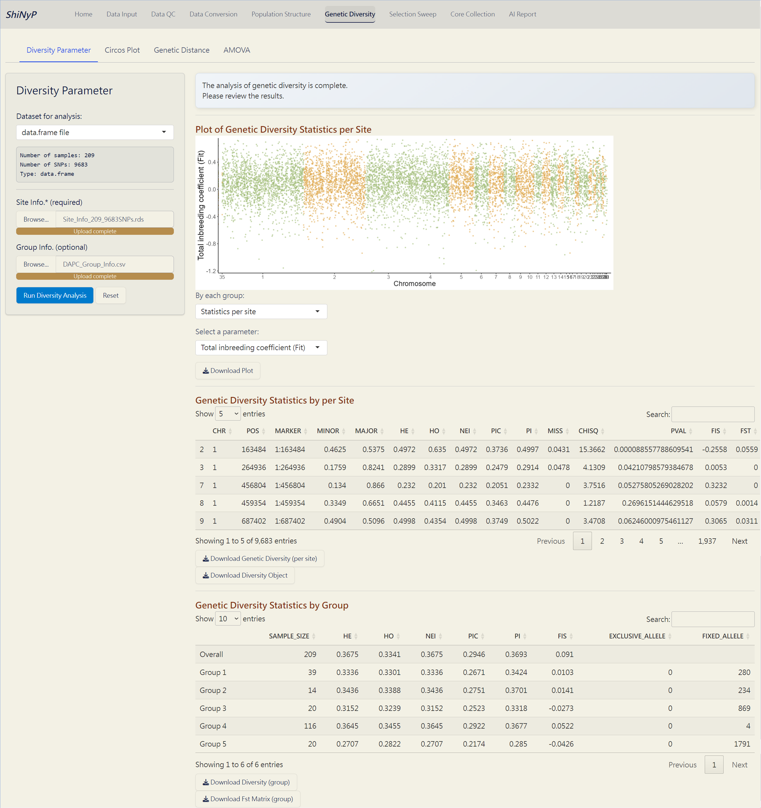
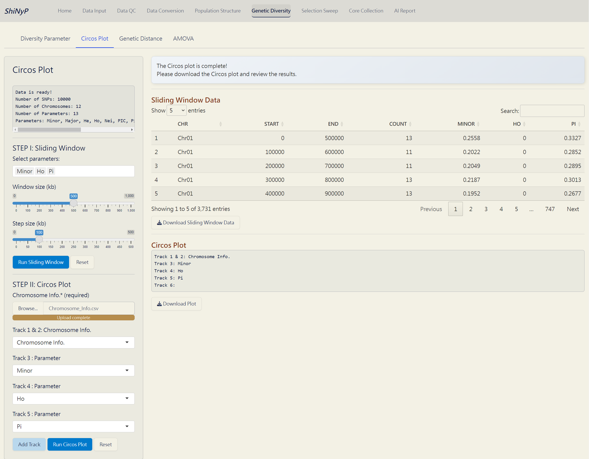
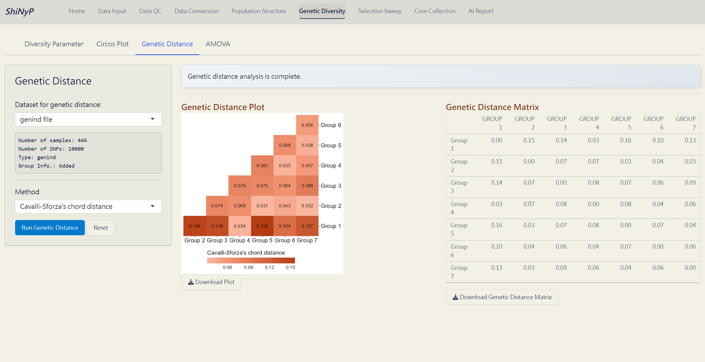
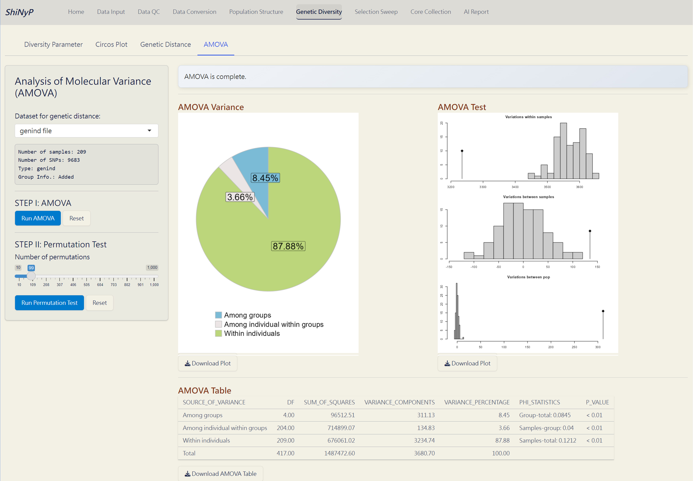

# Genetic Diversity {#sec-genetic-diversity}

::: {.highlighted-text style="background-color: #7c6f41; color: white; padding: 10px 5px; margin: 10px 0px; border-radius: 15px;"}
➡️ This section contains four subpages: [**Diversity
Parameter**]{.underline}, [**Circos Plot**]{.underline}, [**Genetic
Distance**]{.underline}, and [**AMOVA**]{.underline}, allowing you to
conduct various population diversity and differentiation analyses.
:::

{width="650"}

## Diversity Parameter

Calculate key diversity parameters for each SNP site. This approach is
performed using the function from *snpReady* package [@granato2018].

#### Required Datasets: {.unnumbered style="padding: 0px 5px; margin: 0px 10px"}

-   [**`data.frame`**]{style="color: #8b0000;"}
-   **Site Info.** **(RDS)** of the current **`data.frame`**,
    downloadable from [Data Input]{.underline} or [Data QC]{.underline}
    pages.

> **Note:** If you upload Group Info., ensure that each group contains
> at least 2 samples.

------------------------------------------------------------------------

#### **Steps:** {.unnumbered style="padding: 0px 5px; margin: 0px 10px"}

1.  [Upload]{style="background-color: #fceed2;"} **Site Info.**
    (required).

2.  [Upload]{style="background-color: #fceed2;"} **Group Info.** from
    DAPC (optional). If uploaded, population-based parameters will be
    calculated.

3.  Click the [**Run Diversity
    Analysis**]{style="color: #fff;background-color: #007ACC;"} button
    to generate genetic diversity and the following downloadable files.

------------------------------------------------------------------------

#### Outputs: {.unnumbered style="padding: 0px 5px; margin: 0px 10px"}

-   **Plot of Genetic Diversity Statistics per Site (PDF)**: A
    genome-wide scatter plot visualizing the user-selected parameter.

-   **Plot of Genetic Diversity Statistics by Group (PDF)**: A lollipop
    plot visualizing the user-selected parameter.

-   **Genetic Diversity per Site (RDS)**: Contains site information and
    diversity statistics, can be used as input data in the [Selection
    Sweep]{.underline}/[Manhattan Plot]{.underline}^Plus^.

-   **Genetic Diversity Object (RDS)**: Contains all genetic diversity
    results for future use and reproducibility.

-   **Genetic Diversity by Group** **(CSV)**: A table showing genetic
    diversity based on defined group assignments.

-   **Fst Matrix (CSV)**: A table showing pairwise Fst based on defined
    group assignments.

{width="650"}

*Diversity Analysis Complete!*

------------------------------------------------------------------------

## Circos Plot

Genome-wide diversity is visualized using Circos plots generated with
the *circlize* package [@gu2014] based on results of diversity
parameters in a sliding window format.

#### Required Dataset: {#sec-required-dataset-chr .unnumbered style="padding: 0px 5px; margin: 0px 10px"}

-   Auto-import the results from the [Genetic
    Diversity]{.underline}/[Diversity Parameter]{.underline} subpage.

-   **Chromosome Info.** **(CSV)**: Reference genome information of the
    current study. For more details about this file, refer to
    **Section** \@ref(snp-density) **(SNP Density)**.

> **Note:** Please ensure that each chromosome contains at least one SNP
> marker.

------------------------------------------------------------------------

#### **Step 1: Sliding Window** {.unnumbered style="padding: 0px 5px; margin: 0px 10px"}

1.  Select parameters to generate sliding window data.

2.  Choose window size (kb) and step size (kp).

3.  Click the [**Run Sliding
    Window**]{style="color: #fff;background-color: #007ACC;"} button to
    generate sliding window data for circos plot.

------------------------------------------------------------------------

#### **Step 2: Circos Plot** {.unnumbered style="padding: 0px 5px; margin: 0px 10px"}

1.  [Upload]{style="background-color: #fceed2;"} **Chromosome Info.
    (CSV)**.

2.  Select a parameter for each track, and add tracks if necessary (up
    to a maximum of 6).

3.  Click the [**Run Circos
    Plot**]{style="color: #fff;background-color: #007ACC;"} button to
    generate the circos plot.

------------------------------------------------------------------------

#### Outputs: {.unnumbered style="padding: 0px 5px; margin: 0px 10px"}

-   **Sliding Window Data (CSV)**: A sliding window dataset based on
    user-selected parameters.

-   **Circos Plot (PDF)**: A circos plot visualizing the user-selected
    parameters, with the top 1% of each parameter colored in red.

{width="650"}

*Circos Plot Complete!*

------------------------------------------------------------------------

## Genetic Distance

Pairwise genetic distance between populations is computed using
*hierfstat* package. For more information, visit
<a href="https://rdrr.io/cran/hierfstat/man/genet.dist.html" target="_blank">https://rdrr.io/cran/hierfstat/man/genet.dist.html</a>.

#### Required Dataset: {.unnumbered style="padding: 0px 5px; margin: 0px 10px"}

-   [**`genind`**]{style="color: #8b0000;"} with 'Group Info.',
    downloadable from [Data Conversion]{.underline} page after you have
    both the [**`data.frame`**]{style="color: #8b0000;"} and Group Info.

------------------------------------------------------------------------

#### **Steps:** {.unnumbered style="padding: 0px 5px; margin: 0px 10px"}

1.  Select a method.

2.  Click the [**Run Genetic
    Distance**]{style="color: #fff;background-color: #007ACC;"} button
    to generate the pairwise genetic distance.

------------------------------------------------------------------------

#### Outputs: {.unnumbered style="padding: 0px 5px; margin: 0px 10px"}

-   **Genetic Distance Plot (PDF)**: A plot of the pairwise genetic
    distance matrix based on the user-selected method.

-   **Genetic Distance Matrix (CSV)**: A pairwise genetic distance
    matrix based on the user-selected method.

{width="650"}

*Genetic Distance Complete!*

------------------------------------------------------------------------

## AMOVA (Analysis of MOlecular VAriance)

A method for assessing genetic variations and relationships within and
between populations [@excoffier1992].This approach is performed using
the function from *hierfstat* and *poppr* packages [@kamvar2014;
@goudet2004].

#### Required Dataset: {.unnumbered style="padding: 0px 5px; margin: 0px 10px"}

-   [**`genind`**]{style="color: #8b0000;"} with 'Group Info.',
    downloadable from [Data Conversion]{.underline} page after you have
    both the [**`data.frame`**]{style="color: #8b0000;"} and Group Info.

------------------------------------------------------------------------

#### **Step 1: Run AMOVA** {.unnumbered style="padding: 0px 5px; margin: 0px 10px"}

1.  Click the [**Run
    AMOVA**]{style="color: #fff;background-color: #007ACC;"} button to
    partition genetic variation among and within populations.

------------------------------------------------------------------------

#### **Step 2: Run** Permutation Test {.unnumbered style="padding: 0px 5px; margin: 0px 10px"}

1.  Choose the number of randomizations for the permutation test to
    detect the significance of three hierarchical levels. We recommend
    using 9, 99 (default), 199, 499, 799, or 999 permutations for more
    classical *p*-values.

2.  Click the [**Run Permutation
    Test**]{style="color: #fff;background-color: #007ACC;"} button to
    perform the statistical test.

------------------------------------------------------------------------

#### Outputs: {.unnumbered style="padding: 0px 5px; margin: 0px 10px"}

-   **AMOVA Variance Plot (PDF)**: A pie chart showing the explained
    genetic variance of population strata among defined groups.

-   **AMOVA Variance Test (PDF)**: A plot showing the significance test
    of population strata among defined groups. The histograms depict
    randomized strata distributions, with the black line representing
    genetic variance components.

-   **AMOVA Table (CSV)**: A table with detailed AMOVA results.

{width="650"}

*AMOVA Complete!*
