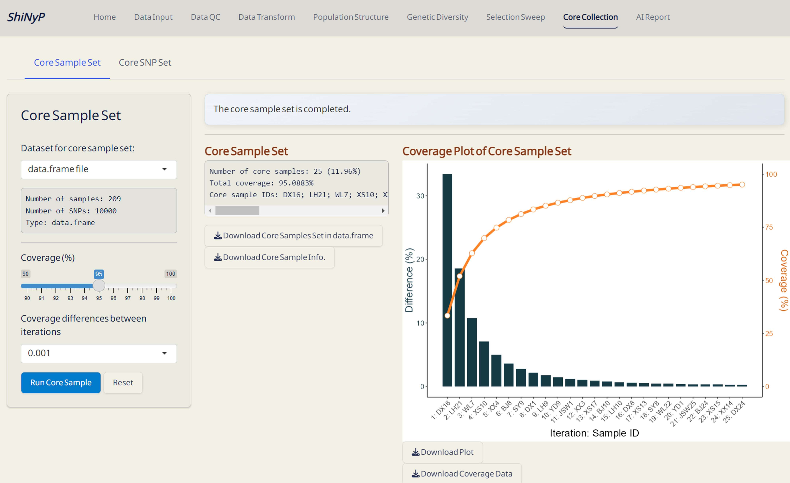
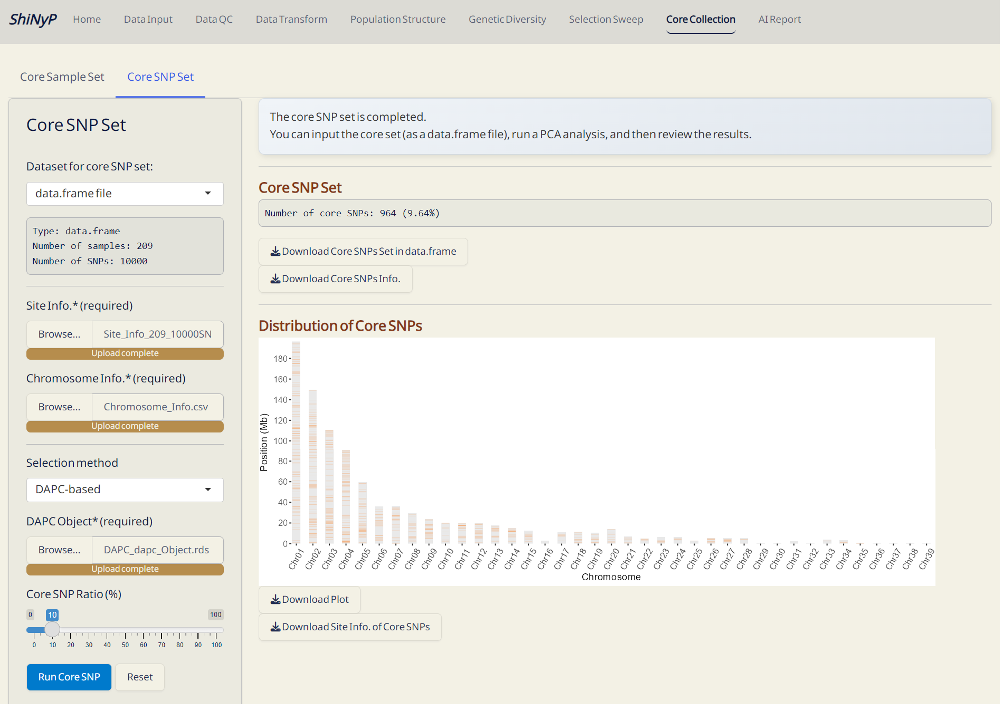

# Core Collection {#sec-core-collection}

::: {style="background-color: #7c6f41; color: white; padding: 10px 5px; margin: 10px 0px; border-radius: 15px;"}
➡️ This section contains two subpages: [**Core Sample
Set**]{.underline}, and [**Core SNP Set**]{.underline}, allowing you to
capture the key samples and SNPs.
:::

{width="650"}

## Core Sample Set

Establish a core collection that represents the genetic variation of the
entire population. This approach is modified function from GenoCore
[@Jeong2017].

#### Required Dataset: {.unnumbered style="padding: 0px 5px; margin: 0px 10px"}

-   [**`data.frame`**]{style="color: #8b0000;"}

------------------------------------------------------------------------

#### **Steps:** {.unnumbered style="padding: 0px 5px; margin: 0px 10px"}

1.  Choose the minimum genetic coverage (%).

2.  Choose the genetic coverage differences between iterations.

3.  Click the [**Run Core
    Sample**]{style="color: #fff;background-color: #007ACC;"} button to
    perform core collection.

------------------------------------------------------------------------

#### Outputs: {.unnumbered style="padding: 0px 5px; margin: 0px 10px"}

-   **Core Sample Coverage Data (CSV)**: A table listing the coverage
    (%) of each iteration and coverage differences between iterations.

-   **Core Sample Set (RDS)**: A
    [**`data.frame`**]{style="color: #8b0000;"} of core samples and
    their genotypic information.

-   **Core Sample Info. (CSV)**: A table listing whether each sample is
    included in the core collection or not, and can be used as input
    data in the [Population Structure]{.underline}/[PCA]{.underline}
    subpage.

-   **Coverage Plot of Core Sample Set (PDF)**: Visualizes the sample
    coverage by each iteration.

{width="650"}

*The Core Sample Set Complete!*

------------------------------------------------------------------------

## Core SNP Set

Establish a core SNP collection that represents the genetic variation
observed in the full dataset or a random SNP set.

#### Required Datasets: {.unnumbered style="padding: 0px 5px; margin: 0px 10px"}

-   [**`data.frame`**]{style="color: #8b0000;"}
-   **Site Info.** **(RDS)** of the current
    [**`data.frame`**]{style="color: #8b0000;"}, downloadable from [Data
    Input]{.underline} or [Data QC]{.underline} pages
-   **Chromosome Info.** **(CSV)**: Reference genome information of the
    current study. For more details about this file, refer to
    **Section** \@ref(snp-density) **(SNP Density)**.
-   **DAPC Object** (DAPC_dapc_Object.rds), downloadable from
    [Population Structure]{.underline}/[DAPC]{.underline} subpage.

------------------------------------------------------------------------

#### **Steps:** {.unnumbered style="padding: 0px 5px; margin: 0px 10px"}

1.  [Upload]{style="background-color: #fceed2;"} required datasts:
    **Site Info. (RDS)** and **Chromosome Info.** **(CSV)**.

2.  Choose the method and [Upload]{style="background-color: #fceed2;"}
    **DAPC Object (RDS)** or set the parameter.

3.  Click the [**Run Core
    SNP**]{style="color: #fff;background-color: #007ACC;"} button to
    perform core collection.

------------------------------------------------------------------------

#### Outputs: {.unnumbered}

-   **Core SNP Set (RDS)**: A
    [**`data.frame`**]{style="color: #8b0000;"} of core SNPs and their
    genotypic information.

-   **Core SNP Info. (RDS)**: A table listing whether each SNP is
    included in the core collection or not.

-   **Distribution of Core SNPs (PDF)**: An ideogram labeling the core
    SNPs.

-   **Site Info. of Core SNPs (RDS)**: Core SNPs site information file.

{width="650"}

*The Core SNP Set Complete!*
