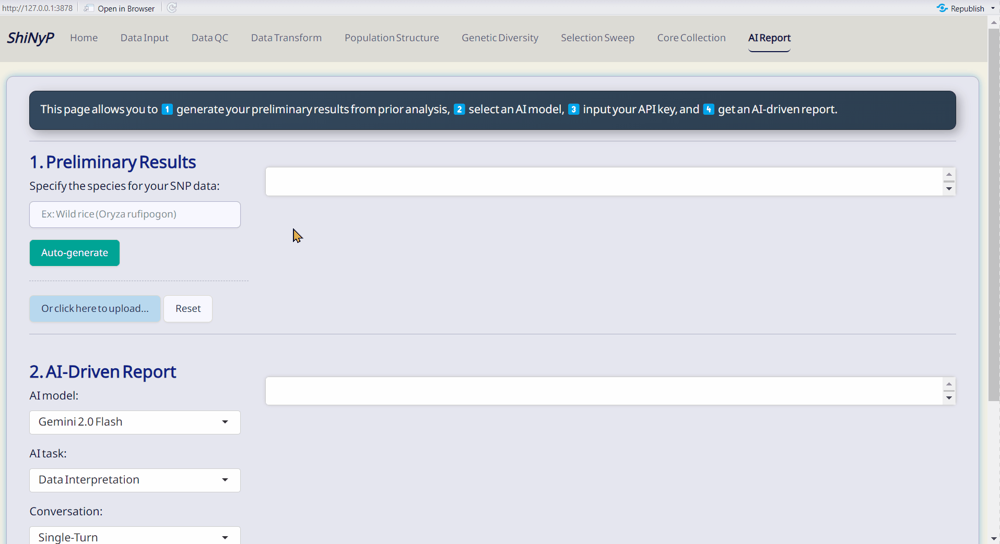
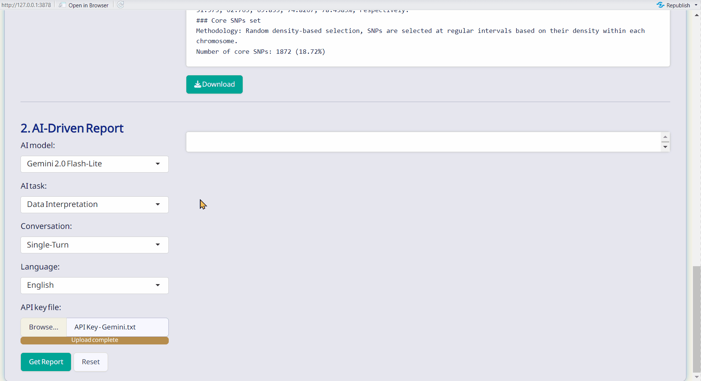

# AI Report {#sec-ai-report}

```{=html}
<!-- Google tag (gtag.js) -->
<script async src="https://www.googletagmanager.com/gtag/js?id=G-2662B66TL7"></script>
<script>
  window.dataLayer = window.dataLayer || [];
  function gtag(){dataLayer.push(arguments);}
  gtag('js', new Date());

  gtag('config', 'G-2662B66TL7');
</script>
```

::: {.highlighted-text style="background-color: #7c6f41; color: white; padding: 10px 5px; margin: 10px 0px; border-radius: 15px;"}
| ➡️ This page is designed to generate the preliminary results from prior analysis, select an AI model, input the API key, and get an AI-driven report. Powered by the *ellmer* package.
:::

------------------------------------------------------------------------

## 📋 Your AI report is almost ready! {.unnumbered style="padding: 0px 5px; margin: 0px 10px"}

#### Step 1: Preliminary Results {.unnumbered style="padding: 0px 5px; margin: 0px 10px"}

1.  Enter the species name for your current analysis.
2.  Click
    [Auto-generate]{style="color: #fff;background-color: #00a595;"}
    button to obtain Preliminary Results.

> **Note**: You can download the Preliminary Results as a **`.txt`**
> file, edit it as needed, and upload it again for 'AI-driven Report'
> use.

{width="6.8in"}

------------------------------------------------------------------------

#### Step 2: AI-Driven Report {.unnumbered style="padding: 0px 5px; margin: 0px 10px"}

> **Note**: Your AI model and API key are now managed globally. Please ensure you have configured them on the **Home** page under the **AI Activation** section before proceeding.

1.  Define the task for the AI model.

2.  Select the conversation mode (*Single-Turn*: one request;
    *Multi-Turn*: up to five requests).

3.  Select the report language.

4.  Click [Get Report]{style="color: #fff;background-color: #00a595;"}
    to obtain AI-driven Report.

5.  Download the **`.docx`** (Word) file with a fully styled,
    professional layout.

{width="6.8in"}

------------------------------------------------------------------------

## 🤖 AI models {#ai-models .unnumbered style="padding: 0px 5px; margin: 0px 10px"}

🆕 For *ShiNyP* v1.2.0, we support 8 AI models:

| Models                   | Developer | Price ^a^                 |
|--------------------------|-----------|---------------------------|
| DeepSeek-V3              | DeepSeek  | \$0.14/\$0.28             |
| 🆕 Gemini 3 Flash        | Google    | **Free** or \$0.10/\$0.40 |
| Gemini 2.5 Flash         | Google    | **Free** or \$0.30/\$2.50 |
| Gemini 2.5 Flash-Lite    | Google    | **Free** or \$0.10/\$0.40 |
| 🆕 GPT-5.5               | OpenAI    | \$10.00/\$30.00           |
| 🆕 GPT-5                 | OpenAI    | \$5.00/\$15.00            |
| 🆕 GPT-5 mini            | OpenAI    | \$0.15/\$0.60             |
| GPT-4.1                  | OpenAI    | \$2.00/\$8.00             |

: ^a^ Price (USD) per 1M Tokens (Input / Output)
⚡ We recommend using Google AI models (https://ai.google.dev/gemini-api/docs/models?hl=zh-tw) ***It is free to get API key & use*** (see below).
💸 If you have paid API access from OpenAI, we recommend using [GPT-5](https://platform.openai.com/docs/models/gpt-5) for high-quality performance. Please note that [GPT-5 mini](https://platform.openai.com/docs/models/gpt-5-mini) is extremely fast and cost-effective.


------------------------------------------------------------------------

## ✨ Tasks for AI {.unnumbered style="padding: 0px 5px; margin: 0px 10px"}

-   **Summary Request**: Provide a clear, structured overview of key SNP
    analysis results.

-   **Data Interpretation**: Clarify findings and highlight key insights
    into population genetics.

-   **Report Structuring**: Create a framework for presenting SNP
    analysis results in a scientific report.

-   **Idea Expansion**: Propose future research directions informed by
    SNP findings.

-   🆕 **Custom Template:** You can upload a template (**`.txt`** file)
    tailored to specific project, and AI will automatically fill in the
    analysis results.

    This reports fully comply with designated standards, enabling truly
    automated and standardized report generation for your lab. *Only
    single-turn conversation is supported.*

    <a class="btn btn-primary" href="assets/AI_Report_Custom_Template.txt" download>
    *Download an example of Custom Template (TXT).*</a>

------------------------------------------------------------------------

## [🔑](https://emojipedia.org/key) **How to get the API key** {.unnumbered style="padding: 0px 5px; margin: 0px 10px"}

**1️⃣ Sign Up or Log In:**

-   Google: <https://aistudio.google.com/>
-   OpenAI: <https://auth.openai.com/create-account>
-   DeepSeek: <https://platform.deepseek.com/sign_in>

2️⃣ **Generate Your API Key:**

-   Google: Click "Create API Key" bottom
    <https://aistudio.google.com/apikey>
-   OpenAI: <https://platform.openai.com/api-keys>
-   DeepSeek: <https://platform.deepseek.com/api_keys>

3️⃣ **Save Your API Key:**

-   Copy the generated key and paste it into a Notepad file.
-   Save the file as **`.txt`** for *ShiNyP* use.

4️⃣ **Manage Billing & Payments:**

-   OpenAI:
    <https://platform.openai.com/settings/organization/billing/overview>
-   DeepSeek: <https://platform.deepseek.com/top_up>

> **Note:** Costs vary depending on the model, conversation mode, and
> the AI task requested.

------------------------------------------------------------------------

## [❌](https://emojipedia.org/cross-mark) Encountered an error? Let’s fix it! {.unnumbered style="padding: 0px 5px; margin: 0px 10px"}

[⚠️](https://emojipedia.org/warning) Error: HTTP 401 Unauthorized

:   This error message indicates that your authentication credentials
    are invalid. This could happen for several reasons, such as:

    (1) You are using a revoked API key.
    (2) You are using a different API key than one under the requesting
        organization.
    (3) You are using an API key that does not have the required
        permissions for the endpoint you are calling.

    To resolve this error, first check that you are using the correct
    API key and organization ID in your request header.

[⚠️](https://emojipedia.org/warning) Error: 'curl_modify_url' is not an exported object from 'namespace:curl'\`

:   This error indicates that your environment is loading an outdated
    version of the `curl` package that lacks the \`curl_modify_url()\`
    helper required by the AI Report module. To resolve this error:

    1.  Restart the R session.
    2.  Update the `curl` package in your R session to the latest
        release.
    3.  Re-launch *ShiNyP* and click [Get
        Report]{style="color: #fff;background-color: #00a595;"} again.

[⚠️](https://emojipedia.org/warning) Error: Failed to Perform HTTP Request

:   This error may indicate that the request timed out, possibly due to
    an excessive input token count, which prevents the AI model from
    completing the task within the allotted time.