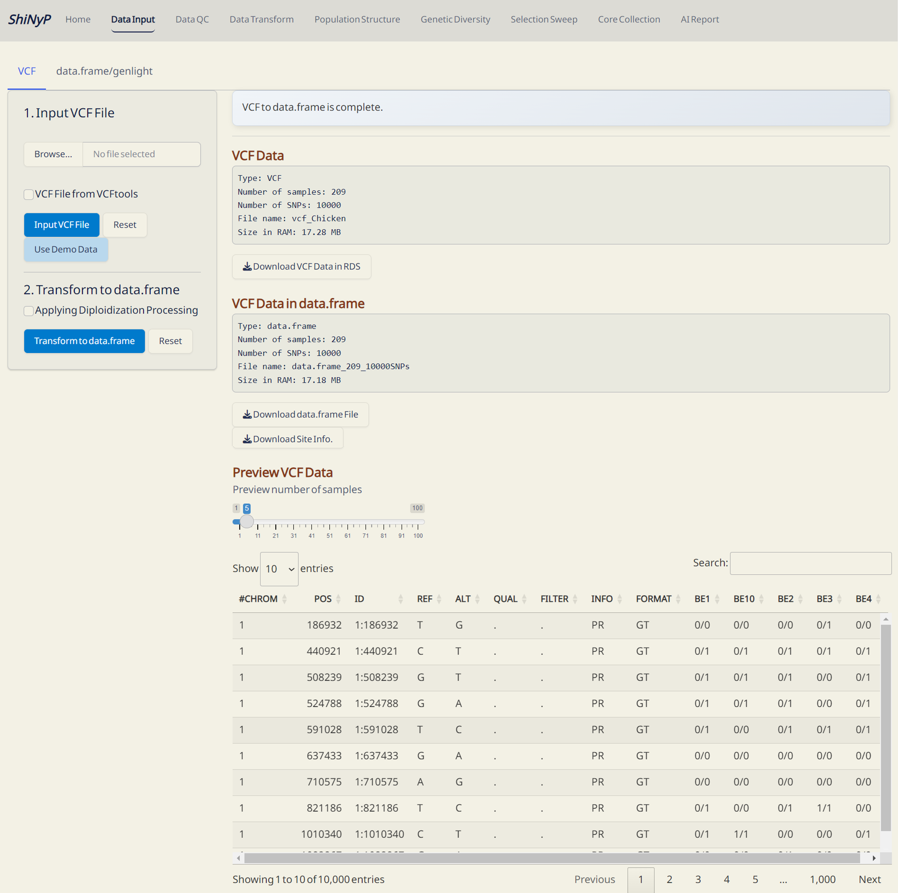
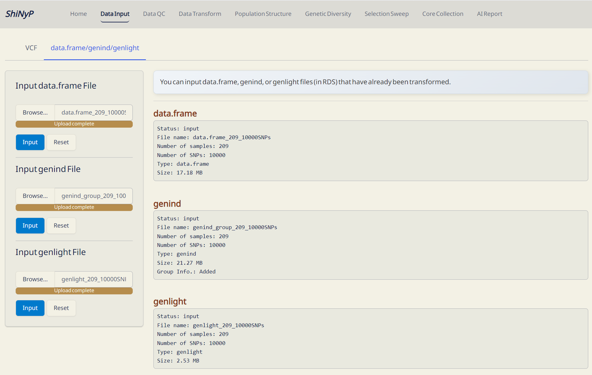

# Data Input {#sec-data-input}

::: {style="background-color: #7c6f41; color: white; padding: 10px 5px; margin: 10px 0px; border-radius: 15px;"}
➡️ This section contains two subpages: [**VCF**]{.underline} and
[**data.frame/genlight**]{.underline}, allowing you to upload various
data types for analysis.
:::

{width="700"}

------------------------------------------------------------------------

## VCF

#### Required Dataset (one of the following): {.unnumbered style="padding: 0px 5px; margin: 0px 10px"}

-   VCF file from
    <a href="https://www.cog-genomics.org/plink/1.9/input" target="_blank">PLINK</a>

-   VCF or gzipped VCF (vcf.gz) file from
    <a href="https://vcftools.sourceforge.net/man_latest.html" target="_blank">VCFtools</a>

-   VCF file in RDS format from [***ShiNyP***]{style="color: #9D6853;"}

The VCF file should contain chromosome and position information in the
first two columns ([**`#CHROM`**]{style="color: #8b0000;"} and
[**`POS`**]{style="color: #8b0000;"}), along with sample names and their
genotypic information. For some whole genome sequencing (WGS) data,
where SNP marker ID information is missing,
[***ShiNyP***]{style="color: #9D6853;"} will auto-generate the SNP ID
names as [#CHROM:POS]{.underline}, such as [2:12500]{.underline},
indicating chromosome 2, position 12500.

<details>

<summary>⚙️ **Using Beagle for Imputation**</summary>

[**Beagle**](https://faculty.washington.edu/browning/beagle/beagle_5.4_18Mar22.pdf)
is a widely used tool for phasing [@browning2021], genotype imputation
[@browning2018], and haplotype inference in diploid and polyploid
species. It supports VCF input/output and uses a Hidden Markov Model
(HMM) for imputation.

**Step 1: Installation**

Download the latest Beagle JAR file:
<https://faculty.washington.edu/browning/beagle/beagle.html>

**Step 2:** **Input Files**

1.  Genotype file (`gt=your_data.vcf.gz`): Contains the target genotypes
    to be imputed.

2.  Reference panel (`ref=reference.vcf.gz`): A phased reference panel
    (optional).

3.  Genetic map (`map=genetic_map.txt`): PLINK format genetic map
    (optional).

Compress and index input files:

``` bash
bgzip your_data.vcf
tabix -p vcf your_data.vcf.gz
```

**Step 3:** **Running Beagle for Imputation**

``` bash
java -Xmx8g -jar beagle.5.4.jar \
  gt=your_data.vcf.gz \
  ref=reference.vcf.gz \
  map=genetic_map.txt \
  out=imputed_output \
  nthreads=8 \
  iterations=20 \
  window=50
```

`gt=your_data.vcf.gz` → Input genotype file (your VCF dataset).\
`ref=reference.vcf.gz` → Reference panel (must be phased and non-missing
alleles).\
`map=genetic_map.txt` → Genetic map (If no map is specified, Beagle
assumes a constant recombination rate of 1 cM per Mb).

`nthreads=8` → Genetic map (uses more CPU threads for faster
computation.).\
`window=50` → Sets window size (default = 40 cM).\
`iterations=20` → Increases iterations for better accuracy (default =
12).

`out=imputed_output` → Output file prefix.

**Output Files**

-   `imputed_output.vcf.gz`: Imputed genotype VCF file.

-   `imputed_output.log`: Log file with summary statistics.

</details>

------------------------------------------------------------------------

#### Step 1: Input your VCF File {.unnumbered style="padding: 0px 5px; margin: 0px 10px"}

1.  [Browse]{style="background-color: #e7eaed;"} and upload one VCF
    file.

2.  If your VCF file is from VCFtools, please tick the 'VCF file from
    VCFtools' checkbox.

3.  After the progress bar shows 'Upload complete', click the [**Input
    VCF File**]{style="color: #fff;background-color: #007ACC;"} button.

*Or use our Demo Data*

1.  Click the [**Use Demo
    Data**]{style="color: #fff;background-color: #007ACC;"} button and
    select one species. Detailed descriptions of the demo datasets are
    available at
    <https://github.com/TeddYenn/ShiNyP/tree/main/inst/demo_data>.

> **Note:** By default, the genotypic information for 5 samples and 10
> SNPs will be displayed on the interactive table.

------------------------------------------------------------------------

#### Step 2: Transform to data.frame {.unnumbered style="padding: 0px 5px; margin: 0px 10px"}

1.  If you have already input a VCF file on
    [***ShiNyP***]{style="color: #9D6853;"}, click the [**Transform to
    data.frame**]{style="color: #fff;background-color: #007ACC;"}
    button.

2.  Download the [**`data.frame`**]{style="color: #8b0000;"} file (in
    RDS format) and Site Info (in RDS format) so that you will not have
    to input the VCF file again; instead, you can upload the
    [**`data.frame`**]{style="color: #8b0000;"} file.

> **Note:** For the current version (v0.1.1),
> [***ShiNyP***]{style="color: #9D6853;"} is optimized for **genome-wide
> SNP** analysis in **diploid species**, supporting a wide range of
> diploid taxa, including plants, animals, and microbial eukaryotes. If
> you have polyploid or haploid dataset, please tick the 'Applying
> diploidization processing' checkbox.

------------------------------------------------------------------------

#### Outputs: {.unnumbered style="padding: 0px 5px; margin: 0px 10px"}

-   **VCF Data (RDS)**: VCF data stored in RDS format, which can be open
    and read in R environment.

-   **data.frame (RDS)**: [**`data.frame`**]{style="color: #8b0000;"}
    file. It's necessary for downstream analyses, *please download and
    save it!*

-   **Site Info. (RDS)**: SNP site information file. It's necessary for
    downstream analyses, *please download and save it!*

> **Note:** If your data is large (more than 1GB), it may take some time
> to process. Please be patient. The
> [***ShiNyP***]{style="color: #9D6853;"} platform processes one task at
> a time (e.g., you must wait for the input process to finish before you
> can reset the data).

{width="650"}

*VCF Data Input!*

------------------------------------------------------------------------

## data.frame/genlight

#### Required Dataset: {.unnumbered style="padding: 0px 5px; margin: 0px 10px"}

-   [**`data.frame`**]{style="color: #8b0000;"} in RDS file format

-   [**`genlight`**]{style="color: #8b0000;"} in RDS file format

| [**`data.frame`**]{style="color: #8b0000;"} file can be downloaded from the subpages [VCF]{.underline}, [Sample QC]{.underline}, [SNP QC]{.underline}, [Core Sample Set,]{.underline} and [Core SNP Set]{.underline}.
| [**`genlight`**]{style="color: #8b0000;"} files can be downloaded from the [Data Transform]{.underline} page.

------------------------------------------------------------------------

#### **One Step:** {.unnumbered style="padding: 0px 5px; margin: 0px 10px"}

1.  [Browse]{style="background-color: #e7eaed;"} and click the
    [**Input**]{style="color: #fff;background-color: #007ACC;"} button
    to upload your [**`data.frame`**]{style="color: #8b0000;"} and
    [**`genlight`**]{style="color: #8b0000;"} files.

{width="650"}

[***`data.frame`***]{style="color: #8b0000;"}*/[**`genlight`**]{style="color: #8b0000;"}
Data Input!*

------------------------------------------------------------------------
