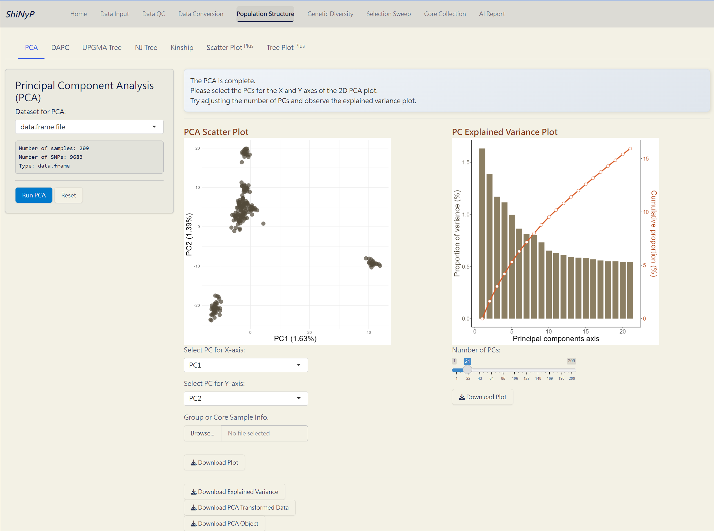
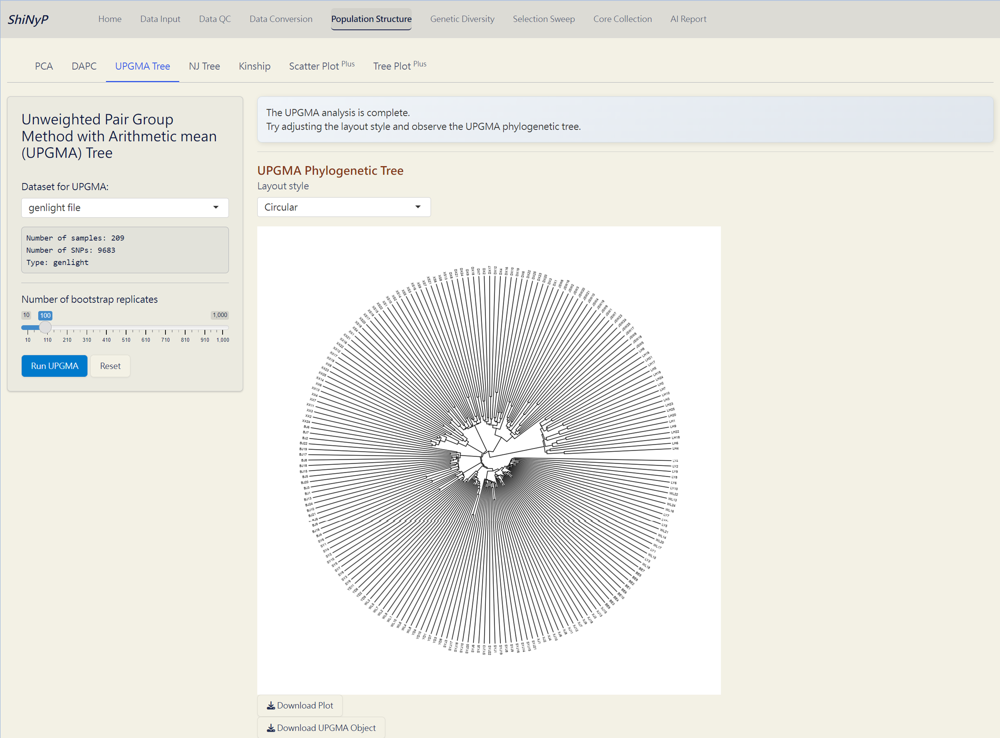
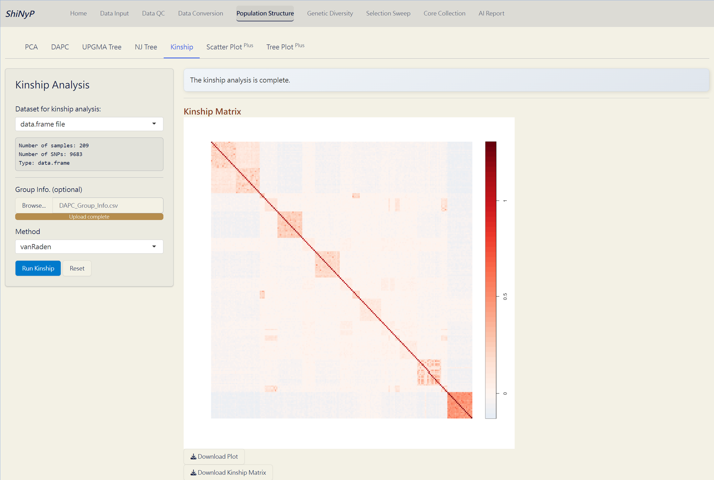
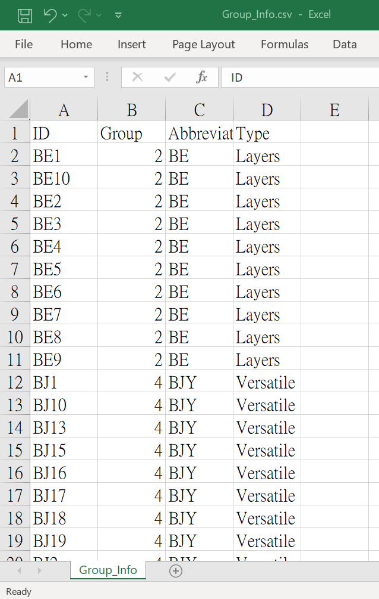
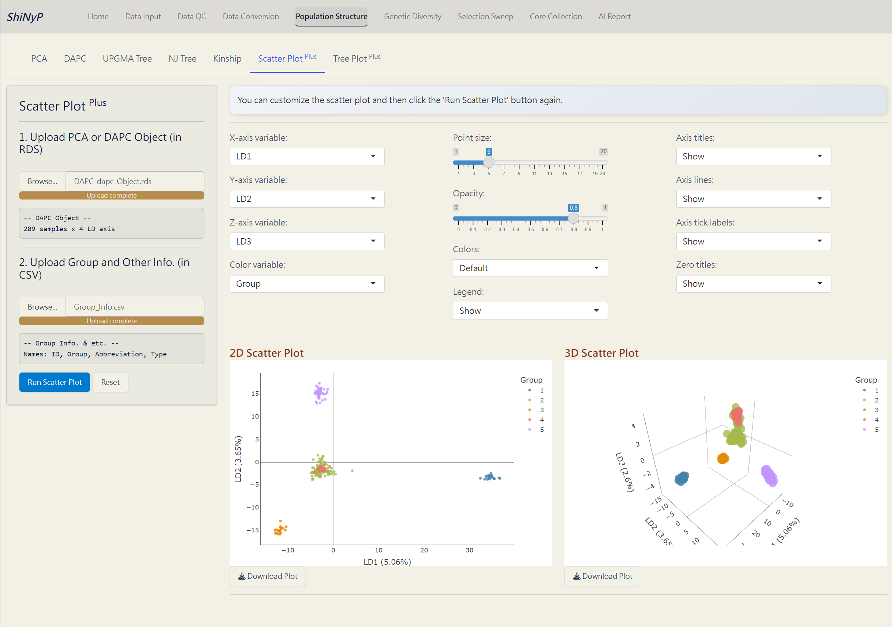

# Population Structure {#sec-population-structure}

::: {.highlighted-text style="background-color: #7c6f41; color: white; padding: 10px 5px; margin: 10px 0px; border-radius: 15px;"}
➡️ This section contains seven subpages: [**PCA**]{.underline},
[**DAPC**]{.underline}, [**UPGMA Tree**]{.underline}, [**NJ
Tree**]{.underline}, [**Kinship**]{.underline}, [**Scatter
Plot**]{.underline}^**Plus**^, and [**Tree Plot**]{.underline}^**Plus**^
allowing you to conduct various population structure analyses and
customize your plot.
:::

{width="650"}

## PCA (Principal Component Analysis)

A widely used method to uncover underlying population structure by
reducing the dimensionality of genetic data.

#### Required Dataset: {.unnumbered style="padding: 0px 5px; margin: 0px 10px"}

-   [**`data.frame`**]{style="color: #8b0000;"}

------------------------------------------------------------------------

#### **One Step:** {.unnumbered style="padding: 0px 5px; margin: 0px 10px"}

1.  Click the [**Run
    PCA**]{style="color: #fff;background-color: #007ACC;"} button to
    generate PCA plots and the following downloadable files.

> **Note**: You can upload the **Group Info.** (from [Population
> Structure]{.underline}/[DAPC]{.underline}) or **Core Sample Info.**
> (from [Core Collection]{.underline}/[Core Sample Set]{.underline}) to
> classify individuals and color them in the PCA Scatter Plot.

------------------------------------------------------------------------

#### Outputs: {.unnumbered style="padding: 0px 5px; margin: 0px 10px"}

-   **PCA Scatter Plot (PDF)**: A scatter plot showing the distribution
    of samples based on principal components, with each dot representing
    an individual.

-   **PC Explained Variance Plot (PDF)**: Visualizes the variance
    explained by each principal component.

-   **Explained Variance (CSV)**: Contains the explained variance of
    each principal component.

-   **PCA Transformed Data (CSV)**: Dataset transformed into principal
    components, with samples as rows and principal components as
    columns.

-   **PCA Object (RDS)**: Contains all PCA results for future use and
    reproducibility, and can be used as input data in the [Population
    Structure]{.underline}/[Scatter Plot]{.underline}^Plus^ subpage.

{width="650"}

*PCA Complete!*

------------------------------------------------------------------------

## DAPC (Discriminant Analysis of Principal Components)

A multivariate method for identifying and visualizing genetic clusters
by combining PCA and Linear Discriminant Analysis (LDA) [@jombart2010].
For more information, visit
<a href="https://adegenet.r-forge.r-project.org/files/tutorial-dapc.pdf" target="_blank">https://adegenet.r-forge.r-project.org/files/tutorial-dapc.pdf</a>.

#### Required Dataset: {.unnumbered style="padding: 0px 5px; margin: 0px 10px"}

-   [**`genind`**]{style="color: #8b0000;"}

------------------------------------------------------------------------

#### Step 1: **Cluster Identification** {.unnumbered style="padding: 0px 5px; margin: 0px 10px"}

1.  Click the [**Run DAPC
    I**]{style="color: #fff;background-color: #007ACC;"} button to
    determine the optimal number of clusters (the lowest BIC value
    indicates the optimal number of clusters).

> **Note:** The default number of PC axes for cluster identification is
> set to retain PCs that capture up to 80% of the total variance. You
> can refer the "PC Explained Variance Plot" in the [Population
> Structure]{.underline}/[PCA]{.underline} subpage.

------------------------------------------------------------------------

#### Step 2: **DAPC Analysis** {.unnumbered style="padding: 0px 5px; margin: 0px 10px"}

1.  Choose the number of cluster (K) based on the "Bayesian Information
    Criterion (BIC) Plot".

2.  Click the [**Run DAPC
    II**]{style="color: #fff;background-color: #007ACC;"} button to
    generate DAPC plots and the following downloadable files.

> **Note**: You can download the "DAPC Object" and upload it on
> [Population Structure]{.underline}/[Scatter Plot]{.underline}^Plus^
> subpage to customize your 2D and 3D scatter plots.

------------------------------------------------------------------------

#### Outputs: {.unnumbered style="padding: 0px 5px; margin: 0px 10px"}

-   **Bayesian Information Criterion (BIC) Plot (PDF)**: Visual
    representation of the BIC for model selection.

-   **Density Plot of First & Second Discriminant Function** **(PDF)**:
    Displays the density of the first and second discriminant functions,
    with each row bar representing an individual.

-   **DAPC Scatter Plot (PDF)**: A scatter plot showing the distribution
    of samples based on discriminant functions (x-axis: first
    discriminant function; y-axis: second discriminant function), with
    each dot representing an individual.

-   **DAPC Membership Probability Plot (PDF)**: Visualizes membership
    probabilities of individuals in different groups, with each row bar
    representing an individual.

-   **DAPC Group Info. (CSV)**: Contains the group assignments for each
    individual based on DAPC. This file used in various subpages.

-   **DAPC Transformed Data (CSV)**: Dataset transformed into
    discriminant functions with samples as rows and discriminant
    functions as columns.

-   **DAPC Object (RDS)**: Contains all results from the DAPC analysis
    for future reproducibility. It can be used as input data in the
    [Population Structure]{.underline}/[Scatter Plot]{.underline}^Plus^
    and [Core Collection]{.underline}/[Core SNP Set]{.underline}
    subpages.

{width="650"}

*DAPC Complete!*

------------------------------------------------------------------------

## UPGMA (Unweighted Pair Group Method with Arithmetic mean) Tree

A classic approaach for constructing rooted trees based on genetic
distance data. UPGMA tree is generated by *poppr* and *ggtree* packages
[@yu2016; @kamvar2014].

#### Required Dataset: {.unnumbered style="padding: 0px 5px; margin: 0px 10px"}

-   [**`genlight`**]{style="color: #8b0000;"}

------------------------------------------------------------------------

#### **Steps**: {.unnumbered style="padding: 0px 5px; margin: 0px 10px"}

1.  Choose the number of bootstrap replicates, which will be used for
    assessing the confidence of the branching structure.

2.  Click the [**Run
    UPGMA**]{style="color: #fff;background-color: #007ACC;"} button to
    generate tree plot.

> **Note**: You can download the "UPGMA Object" and upload it on
> [Population Structure]{.underline}/[Tree Plot]{.underline}^Plus^
> subpage to customize your phylogenetic tree.

------------------------------------------------------------------------

#### Outputs: {.unnumbered style="padding: 0px 5px; margin: 0px 10px"}

-   **UPGMA Phylogenetic Tree (PDF)**: A UPGMA rooted tree with a
    user-defined layout style.

-   **UPGMA Object (RDS)**: Contains all information of the UPGMA tree,
    and can be used as input data in the [Population
    Structure]{.underline}/[Tree Plot]{.underline}^Plus^ subpage.

{width="650"}

*UPGMA Tree Complete!*

------------------------------------------------------------------------

## NJ (Neighbor-Joining) Tree

A method for building unrooted trees using genetic distance data. NJ
tree is generated by *ape* and *ggtree* packages [@paradis2018;
@yu2016].

#### Required Dataset: {.unnumbered style="padding: 0px 5px; margin: 0px 10px"}

-   [**`genlight`**]{style="color: #8b0000;"}

------------------------------------------------------------------------

#### **One Step:** {.unnumbered style="padding: 0px 5px; margin: 0px 10px"}

1.  Click the [**Run
    NJ**]{style="color: #fff;background-color: #007ACC;"} button to
    generate tree plot.

> **Note**: You can download the "NJ Object" and upload it on
> [Population Structure]{.underline}/[Tree Plot]{.underline}^Plus^
> subpage to customize your phylogenetic tree.

------------------------------------------------------------------------

#### Outputs: {.unnumbered style="padding: 0px 5px; margin: 0px 10px"}

-   **NJ Phylogenetic Tree (PDF)**: A NJ unrooted tree with a
    user-defined layout style.

-   **NJ Object (RDS)**: Contains all information of the NJ tree, and
    can be used as input data in the [Population
    Structure]{.underline}/[Tree Plot]{.underline}^Plus^ subpage.

{width="650"}

*NJ Tree Complete!*

------------------------------------------------------------------------

## Kinship Analysis

A statistical method for assessing genetic relationships and relatedness
among individuals based on shared alleles [@kang2010]. Kinship matrix is
generated by *statgenGWAS* package.For more information, visit
<a href="https://rdrr.io/cran/statgenGWAS/man/kinship.html" target="_blank">https://rdrr.io/cran/statgenGWAS/man/kinship.html</a>.

#### Required Dataset: {.unnumbered style="padding: 0px 5px; margin: 0px 10px"}

-   [**`data.frame`**]{style="color: #8b0000;"}

------------------------------------------------------------------------

#### **Steps:** {.unnumbered style="padding: 0px 5px; margin: 0px 10px"}

1.  [Upload]{style="background-color: #fceed2;"} **Group Info.** from
    [Population Structure]{.underline}/[DAPC]{.underline} (optional). If
    uploaded, the order of samples will follow the group assignment;
    otherwise, it will follow the order of the original VCF data.

2.  Choose a method to run kinship analysis.

3.  Click the [**Run
    Kinship**]{style="color: #fff;background-color: #007ACC;"} button to
    generate the kinship matrix.

------------------------------------------------------------------------

#### Outputs: {.unnumbered style="padding: 0px 5px; margin: 0px 10px"}

-   **Kinship Matrix Plot (PDF)**: A visual representation of the
    kinship matrix.

-   **Kinship Matrix (RDS)**: Contains the kinship matrix data.

> Note: This kinship matrix can be directly used as input for *GAPIT*
> package in genome-wide association studies (GWAS), helping to control
> for confounding effects.

{width="650"}

*Kinship Analysis Complete!*

------------------------------------------------------------------------

## Scatter Plot ^Plus^

Customize your scatter plot based on the results from [Population
Structure]{.underline}/[PCA]{.underline} or [Population
Structure]{.underline}/[DAPC]{.underline}.

#### Required Files: {.unnumbered style="padding: 0px 5px; margin: 0px 10px"}

-   **PCA Object** (PCA_prcomp_Object.rds file) or **DAPC Object**
    (DAPC_dapc_Object.rds file)
-   **Group and Other Info.** (i.e. metadata, modifiable from
    DAPC_Group_Info.csv)

> **Note**: You can add more information about samples by adding new
> variables to the Group Info. file. Ensure that the sample order
> remains unchanged.

➡️ Example: Group Info. file (CSV).

{width="350"}

------------------------------------------------------------------------

#### **Steps:** {.unnumbered style="padding: 0px 5px; margin: 0px 10px"}

1.  [Upload]{style="background-color: #fceed2;"} **PCA or DAPC Object
    (RDS)**

2.  [Upload]{style="background-color: #fceed2;"} **Group and Other Info.
    (CSV)**

3.  Click the [**Run Scatter
    Plot**]{style="color: #fff;background-color: #007ACC;"} button to
    generate the 2D and 3D interactive scatter plots.

4.  Customize the scatter plot and click the [**Run Scatter
    Plot**]{style="color: #fff;background-color: #007ACC;"} button
    again.

> **Note**: The scatter plots are downloaded as HTML files and can be
> opened with browsers like Chrome or Edge.

------------------------------------------------------------------------

#### Outputs: {.unnumbered style="padding: 0px 5px; margin: 0px 10px"}

-   **2D Scatter Plot (HTML)**: Two-dimensional interactive scatter plot
    with user-defined attributes.

-   **3D Scatter Plot (HTML)**: Three-dimensional interactive scatter
    plot with user-defined attributes.

{width="650"}

*Scatter Plot ^Plus^ Complete!*

## Tree Plot ^Plus^

Customize your phylogenetic tree plot based on the results from
[Population Structure]{.underline}/[UPGMA]{.underline} or [Population
Structure]{.underline}/[NJ]{.underline}.

#### Required Files: {.unnumbered style="padding: 0px 5px; margin: 0px 10px"}

-   **UPGMA Object** (UPGMA_phylo_Object.rds file) or **NJ Object**
    (NJ_phylo_Object.rds file)
-   **Group and Other Info.** (modifiable from DAPC_Group_Info.csv)

> **Note**: You can add more information about samples by adding new
> variables to the Group Info. file. Ensure that the sample order
> remains unchanged.

------------------------------------------------------------------------

#### **Steps:** {.unnumbered style="padding: 0px 5px; margin: 0px 10px"}

1.  [Upload]{style="background-color: #fceed2;"} **UPGMA or NJ Object
    (RDS)**

2.  [Upload]{style="background-color: #fceed2;"} **Group and Other Info.
    (CSV)**

3.  Click the [**Run Tree
    Plot**]{style="color: #fff;background-color: #007ACC;"} button to
    generate the tree plot.

4.  Customize the tree plot and click the [**Run Tree
    Plot**]{style="color: #fff;background-color: #007ACC;"} button
    again.

------------------------------------------------------------------------

#### Outputs: {.unnumbered style="padding: 0px 5px; margin: 0px 10px"}

-   **Phylogenetic Tree Plot (PDF)**: A phylogenetic tree plot with
    user-defined layout style and attributes.

{width="650"}

*Tree Plot ^Plus^ Complete!*
