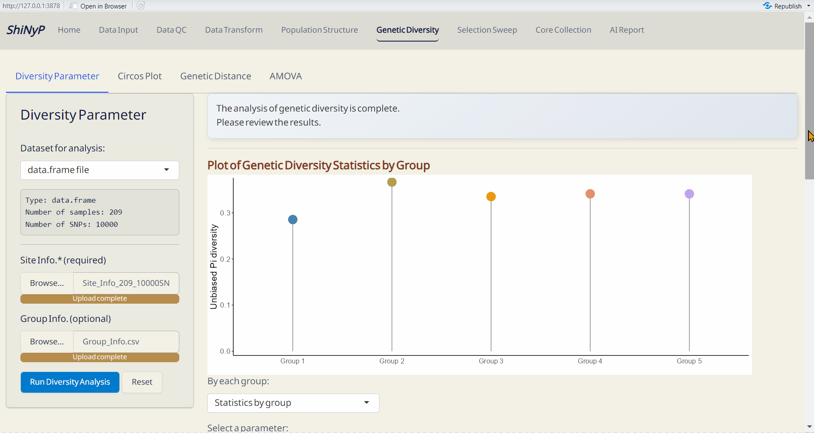
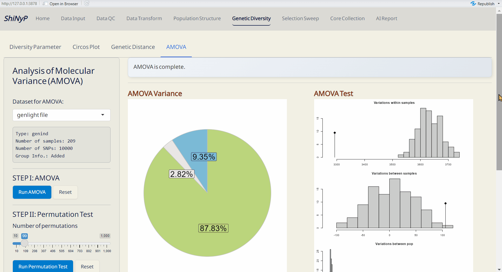

# Genetic Diversity {#sec-genetic-diversity}

```{=html}
<!-- Google tag (gtag.js) -->
<script async src="https://www.googletagmanager.com/gtag/js?id=G-2662B66TL7"></script>
<script>
  window.dataLayer = window.dataLayer || [];
  function gtag(){dataLayer.push(arguments);}
  gtag('js', new Date());

  gtag('config', 'G-2662B66TL7');
</script>
```

::: {.highlighted-text style="background-color: #7c6f41; color: white; padding: 10px 5px; margin: 10px 0px; border-radius: 15px;"}
➡️ This section includes four subpages: [Diversity
Parameter]{.underline}, [Circos Plot]{.underline}, [Genetic
Distance]{.underline}, and [AMOVA]{.underline}, allowing you to conduct
various population diversity and differentiation analyses.
:::

{width="6.8in"}

## Diversity Parameter

Calculate key diversity parameters for each SNP site. This approach is
performed using the function from *snpReady* package [@granato2018].

#### Required File: {.unnumbered style="padding: 0px 5px; margin: 0px 10px"}

-   *data.frame*
-   Site Info. (RDS) of the current *data.frame*, downloadable from
    [Data Input]{.underline} or [Data QC]{.underline} pages.

> **Note:** If you upload Group Info., ensure that each group contains
> at least 2 samples.

------------------------------------------------------------------------

#### **Steps:** {.unnumbered style="padding: 0px 5px; margin: 0px 10px"}

1.  Upload Site Info. (required).

2.  Upload Group Info. from [Population
    Structure]{.underline}/[DAPC]{.underline} subpage (optional). If
    uploaded, population-based parameters will be calculated.

    <a class="btn btn-primary" href="assets/Group_Info.csv" download>
    *Download an example of Group Info. (CSV).*</a>

3.  Click [Run Diversity
    Analysis]{style="color: #fff;background-color: #007ACC;"} to
    generate genetic diversity and the following downloadable files.

------------------------------------------------------------------------

#### Outputs: {.unnumbered style="padding: 0px 5px; margin: 0px 10px"}

-   Plot of Genetic Diversity Statistics per Site (PDF): A genome-wide
    scatter plot visualizing the user-selected parameter.
-   Plot of Genetic Diversity Statistics by Group (PDF): A lollipop plot
    visualizing the user-selected parameter.
-   Genetic Diversity per Site (RDS): Contains site information and
    diversity statistics, can be used as input data in the [Selection
    Sweep]{.underline}/[Manhattan Plot]{.underline}^Plus^.
-   Genetic Diversity Object (RDS): Contains all genetic diversity
    results for future use and reproducibility.
-   Genetic Diversity by Group (CSV): A table showing genetic diversity
    based on defined group assignments.
-   Fst Matrix (CSV): A table showing pairwise Fst based on defined
    group assignments.

{width="6.8in"}

------------------------------------------------------------------------

## Circos Plot

Genome-wide diversity is visualized using Circos plots generated with
the *circlize* package [@gu2014] based on results of diversity
parameters in a sliding window format.

#### Required File: {.unnumbered style="padding: 0px 5px; margin: 0px 10px"}

-   Auto-import the results from the [Genetic
    Diversity]{.underline}/[Diversity Parameter]{.underline} subpage.

-   Chromosome Info. (CSV): Reference genome information of the current
    study.

    For more details about this file, refer to Section
    \@ref(snp-density) (SNP Density).

    <a class="btn btn-primary" href="assets/Chromosome_Info.csv" download>
    *Download an example of Chromosome Info. (CSV).*</a>

> **Note:** Please ensure that each chromosome contains at least one SNP
> marker.

------------------------------------------------------------------------

#### **Step 1: Sliding Window** {.unnumbered style="padding: 0px 5px; margin: 0px 10px"}

1.  Select parameters to generate sliding window data.
2.  Choose window size (kb) and step size (kp).
3.  Click [Run Sliding
    Window]{style="color: #fff;background-color: #007ACC;"} to generate
    sliding window data for Circos plot.

------------------------------------------------------------------------

#### **Step 2: Circos Plot** {.unnumbered style="padding: 0px 5px; margin: 0px 10px"}

1.  Upload Chromosome Info. (CSV).
2.  Select a parameter for each track, and add tracks if necessary (up
    to a maximum of 6).
3.  Click [Run Circos
    Plot]{style="color: #fff;background-color: #007ACC;"} to generate
    the Circos plot.

------------------------------------------------------------------------

#### Outputs: {.unnumbered style="padding: 0px 5px; margin: 0px 10px"}

-   Sliding Window Data (CSV): A sliding window dataset based on
    user-selected parameters.
-   Circos Plot (PDF): This circos plot visualizes the user-selected
    parameters, highlighting the top 1% of each parameter in red.
    Chromosome information is displayed on track 1, with coordinates
    scaled in megabases (Mb).

------------------------------------------------------------------------

## Genetic Distance

Pairwise genetic distance between populations is computed using
*hierfstat* package. For more information, visit
<https://rdrr.io/cran/hierfstat/man/genet.dist.html>.

#### Required File: {.unnumbered style="padding: 0px 5px; margin: 0px 10px"}

-   *data.frame*

-   Group Info. from [Population
    Structure]{.underline}/[DAPC]{.underline} subpage (required).

    <a class="btn btn-primary" href="assets/Group_Info.csv" download>
    *Download an example of Group Info. (CSV).*</a>

------------------------------------------------------------------------

#### **Steps:** {.unnumbered style="padding: 0px 5px; margin: 0px 10px"}

1.  Upload Group Info.
2.  Select a method.
3.  Click [Run Genetic
    Distance]{style="color: #fff;background-color: #007ACC;"} to
    generate the pairwise genetic distance.

------------------------------------------------------------------------

#### Outputs: {.unnumbered style="padding: 0px 5px; margin: 0px 10px"}

-   Genetic Distance Plot (PDF): A plot of the pairwise genetic distance
    matrix based on the user-selected method.
-   Genetic Distance Matrix (CSV): A pairwise genetic distance matrix
    based on the user-selected method.

{width="6.8in"}

------------------------------------------------------------------------

## AMOVA (Analysis of MOlecular VAriance)

A method for assessing genetic variations and relationships within and
between populations [@excoffier1992]. This approach is performed using
the function from *hierfstat* and *poppr* packages [@kamvar2014;
@goudet2004].

#### Required File: {.unnumbered style="padding: 0px 5px; margin: 0px 10px"}

-   *genlight* with 'Group Info.', downloadable from [Data
    Transform]{.underline} page after you have Group Info.

------------------------------------------------------------------------

#### **Step 1: Run AMOVA** {.unnumbered style="padding: 0px 5px; margin: 0px 10px"}

1.  Click [Run AMOVA]{style="color: #fff;background-color: #007ACC;"} to
    partition genetic variation among and within populations.

------------------------------------------------------------------------

#### **Step 2: Run** Permutation Test {.unnumbered style="padding: 0px 5px; margin: 0px 10px"}

1.  Choose the number of randomizations for the permutation test to
    detect the significance of three hierarchical levels. We recommend
    using 9, 99 (default), 199, 499, 799, or 999 permutations for more
    classical *p*-values.
2.  Click [Run Permutation
    Test]{style="color: #fff;background-color: #007ACC;"} to perform the
    statistical test.

------------------------------------------------------------------------

#### Outputs: {.unnumbered style="padding: 0px 5px; margin: 0px 10px"}

-   AMOVA Variance Plot (PDF): A pie chart showing the explained genetic
    variance of population strata among defined groups.
-   AMOVA Variance Test (PDF): A plot showing the significance test of
    population strata among defined groups. The histograms depict
    randomized strata distributions, with the black line representing
    genetic variance components.
-   AMOVA Table (CSV): A table with detailed AMOVA results.

{width="6.8in"}
