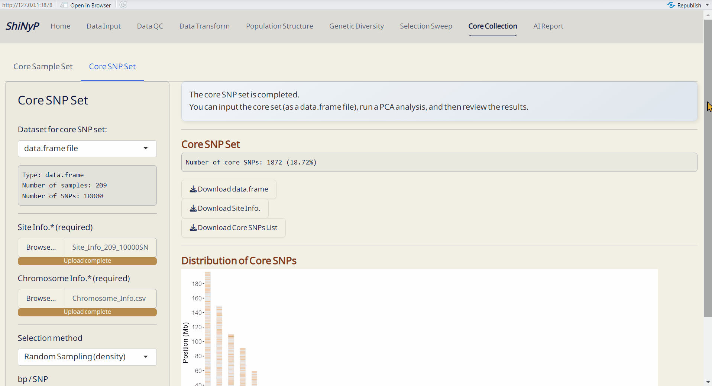

# Core Collection {#sec-core-collection}

```{=html}
<!-- Google tag (gtag.js) -->
<script async src="https://www.googletagmanager.com/gtag/js?id=G-2662B66TL7"></script>
<script>
  window.dataLayer = window.dataLayer || [];
  function gtag(){dataLayer.push(arguments);}
  gtag('js', new Date());

  gtag('config', 'G-2662B66TL7');
</script>
```

::: {style="background-color: #7c6f41; color: white; padding: 10px 5px; margin: 10px 0px; border-radius: 15px;"}
➡️ This section includes two subpages: [Core Sample Set]{.underline},
and [Core SNP Set]{.underline}, allowing you to capture the key samples
and SNPs.
:::

{width="6.8in"}

## Core Sample Set

Establish a core collection that represents the genetic variation of the
entire population. This approach is modified function from GenoCore
[@Jeong2017].

#### Required File: {.unnumbered style="padding: 0px 5px; margin: 0px 10px"}

-   *data.frame*

------------------------------------------------------------------------

#### **Steps:** {.unnumbered style="padding: 0px 5px; margin: 0px 10px"}

1.  Choose the minimum genetic coverage (%).
2.  Choose the minimum genetic coverage differences between iterations.
3.  Click [Run Core
    Sample]{style="color: #fff;background-color: #007ACC;"} to perform
    core collection.

------------------------------------------------------------------------

#### Outputs: {.unnumbered style="padding: 0px 5px; margin: 0px 10px"}

-   Core Sample Coverage Data (CSV): A table listing the coverage (%) of
    each iteration and coverage differences between iterations.
-   Core Sample Set (RDS): A *data.frame* of core samples and their
    genotypic information.
-   Core Sample Info. (CSV): A table listing whether each sample is
    included in the core collection or not, and can be used as input
    data in the [Population Structure]{.underline}/[PCA]{.underline}
    subpage.
-   Coverage Plot of Core Sample Set (PDF): Visualizes the sample
    coverage by each iteration.

{width="6.8in"}

------------------------------------------------------------------------

## Core SNP Set

Establish a core SNP collection that represents the genetic variation
observed in the full dataset or a random SNP set.

#### Required Files: {.unnumbered style="padding: 0px 5px; margin: 0px 10px"}

-   *data.frame*

-   Site Info. (RDS) of the current *data.frame*, downloadable from
    [Data Input]{.underline} or [Data QC]{.underline} pages

-   Chromosome Info. (CSV): Reference genome information of the current
    study. For more details about this file, refer to Section
    \@ref(snp-density) (SNP Density).

    <a class="btn btn-primary" href="assets/Chromosome_Info.csv" download>
    *Download an example of Chromosome Info. (CSV).*</a>

-   DAPC Object (DAPC_dapc_Object.rds), downloadable from [Population
    Structure]{.underline}/[DAPC]{.underline} subpage.

------------------------------------------------------------------------

#### **Steps:** {.unnumbered style="padding: 0px 5px; margin: 0px 10px"}

1.  Upload required datasts: Site Info. (RDS) and Chromosome Info.
    (CSV).
2.  Choose the method and Upload DAPC Object (RDS) or set the parameter.
3.  Click the [Run Core
    SNP]{style="color: #fff;background-color: #007ACC;"} to perform core
    collection.

------------------------------------------------------------------------

#### Outputs: {.unnumbered}

-   Core SNP Set (RDS): A *data.frame* of core SNPs and their genotypic
    information.
-   Core SNP Info. (RDS): A table listing whether each SNP is included
    in the core collection or not.
-   Distribution of Core SNPs (PDF): An ideogram labeling the core SNPs.
-   Site Info. of Core SNPs (RDS): Core SNPs site information file.

{width="6.8in"}
