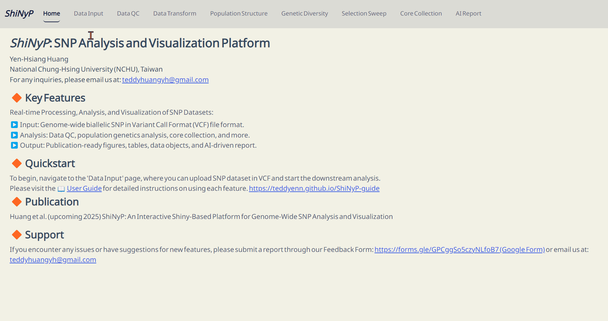
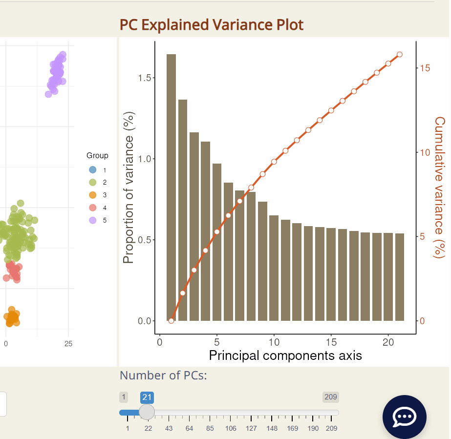
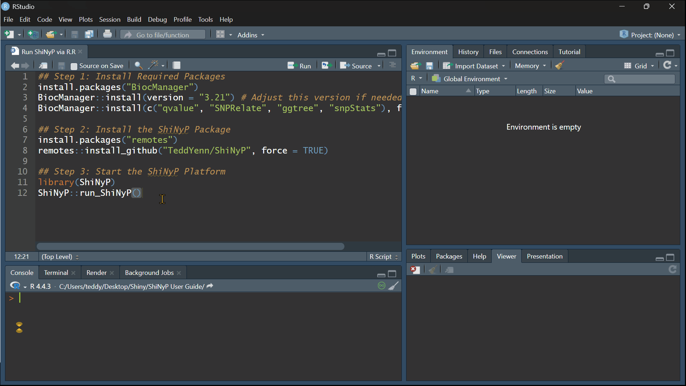

# Welcome to *ShiNyP* {#sec-welcome .unnumbered}

```{=html}
<!-- Google tag (gtag.js) -->
<script async src="https://www.googletagmanager.com/gtag/js?id=G-2662B66TL7"></script>
<script>
  window.dataLayer = window.dataLayer || [];
  function gtag(){dataLayer.push(arguments);}
  gtag('js', new Date());

  gtag('config', 'G-2662B66TL7');
</script>
```

::: {style="display: flex; align-items: center;"}
<a href="https://github.com/TeddYenn/ShiNyP">

</a>

<p>This work, primarily authored by Yen-Hsiang Huang from the Department
of Agronomy, National Chung Hsing University, Taiwan, is licensed under
the [GNU Affero General Public
License](https://www.gnu.org/licenses/agpl-3.0.en.html).</p>
:::

Last Updated: Jun 2025

------------------------------------------------------------------------

## Quickstart {.unnumbered}

🚀 [**Run *ShiNyP* via
R**](https://teddyenn.github.io/ShiNyP-guide/get-started.html#sec-run-shinyp-via-r)

🚀 [**Run *ShiNyP* via
Docker**](https://teddyenn.github.io/ShiNyP-guide/get-started.html#sec-run-shinyp-via-docker)

📢 [***ShiNyP*** **Online Version – Trial
Platform**](https://teddyhuang.shinyapps.io/ShiNyP_Demo/)

------------------------------------------------------------------------

## Overview {.unnumbered}

*ShiNyP* is a platform designed for real-time processing, analysis, and
visualization of SNP datasets.

::: {style="background-color: #7c6f41; color: white; padding: 10px 5px; margin: 10px 0px; border-radius: 15px;"}
| 📄 **Input:** Genome-wide biallelic SNP in Variant Call Format (VCF) file.
| 📊 **Analysis:** Data QC, population genetics analysis, core collection, and more.
| 📋 **Output:** Publication-ready figures, tables, R objects, and free AI-driven report.
:::

{width="6.8in"}

------------------------------------------------------------------------

## Publication {.unnumbered}

If you use *ShiNyP* in your research, please cite:

> Huang, Y.-H., Chen, L.-Y., Septiningsih E. M., Kao, P.-H., Kao, C.-F.
> (2025) *ShiNyP*: Unlocking SNP-Based Population Genetics—AI-Assisted
> Platform for Rapid and Interactive Visual Exploration. *Molecular
> Biology and Evolution*, *42*(6), msaf117.
> <https://doi.org/10.1093/molbev/msaf117>

In addition, please acknowledge the R packages utilized in your
analysis. The relevant citations and descriptions for each module are
detailed in the *ShiNyP* [User
Guide](https://teddyenn.github.io/ShiNyP-guide/).

------------------------------------------------------------------------

## **Updates and Support** {.unnumbered}

Aug 2024: alpha version

:   

Oct 2024: v0.1.0

:   

Feb 2025: v0.1.1

:   

Apr 2025: v0.2.0

:   | - Enhanced AI report functionality with new options and models.
    | - Improved readability of preliminary results.
    | - Added more methods for constructing core SNP set.
    | - Added the Docker-based installation.

May 2025: v1.0.0 on [GitHub](https://github.com/TeddYenn/ShiNyP/releases/tag/v1.0.0).

:   | - Introduced the **new *ShiNyP* AI chatbot**.
    | - Enhanced AI report features and deprecated older AI models.
    | - Added publication details.
    | - Made UI/UX improvements.
    | - Fixed several bugs.

🆕 Jun 2025: v1.1.0 on [GitHub](https://github.com/TeddYenn/ShiNyP/releases/tag/v1.1.0).

:   | - Enhanced AI report features.
    | - Enhanced *ShiNyP* *AI* chatbot.
    | - Made UI/UX improvements.
    | - Fixed several bugs.

🛠️ Aug 2025: v1.2.0.

:   | - Adding new features.

🔽 🐣 *ShiNyP AI* Chatbot!

{width="5.5in"}

<br>

:   If you encounter any issues or have suggestions for new features,
    please submit a request on the [GitHub Issues
    page](https://github.com/TeddYenn/ShiNyP/issues) or email us at:
    [teddyhuangyh\@gmail.com](#0)

------------------------------------------------------------------------

> **This is the User Guide site for *ShiNyP*, live at [GitHub
> Page](https://teddyenn.github.io/ShiNyP-guide/).**

# **Get Started** 🚀 {.unnumbered}

There are two easy ways to install and run *ShiNyP*:

1.  **Using R**:\
    This method is suitable if you already have R installed or prefer
    working within the R environment. You’ll need to install some R
    packages and then launch *ShiNyP* directly from R environment. ▸
    R/RStudio/Rtools Tutorial for Beginners! (#Developing)

2.  **Using Docker**:\
    This is the simpler option if you’d rather skip installing R or any
    packages. With Docker, you can run *ShiNyP* in a ready-to-use setup
    with just one command. ▸ Docker Tutorial for Beginners!
    (#Developing)

<br>

------------------------------------------------------------------------

## 🔘 Run *ShiNyP* via R {#sec-run-shinyp-via-r .unnumbered}

#### **✅ Prerequisites** {.unnumbered}

Before installing *ShiNyP*, ensure your system meets the following
requirements:

-   [**R**](https://www.r-project.org/): Version ≥ 4.4.

    Check your current version in R: **`getRversion()`**

-   [**Bioconductor**](https://www.bioconductor.org/install/): Version ≥
    3.20.

    Match your Bioconductor version with your R version (e.g., use
    Bioconductor 3.21 if R = 4.5).

#### **1️⃣ Install Required Package** {.unnumbered}

``` r
install.packages("BiocManager")
BiocManager::install(version = "3.21") # Use the version that matches your R
BiocManager::install(c("qvalue", "SNPRelate", "ggtree", "snpStats"), force = TRUE)
```

#### **2️⃣ Install the *ShiNyP* Package** {.unnumbered}

``` r
install.packages("remotes")
remotes::install_github("TeddYenn/ShiNyP", force = TRUE)
```

#### **3️⃣ Start the *ShiNyP* Platform** {.unnumbered}

``` r
library(ShiNyP)
ShiNyP::run_ShiNyP()
```

#### **4️⃣ Run Analysis on *ShiNyP*** {.unnumbered}

Input your SNP dataset in VCF, or try the built-in [**Demo
Data**]{style="color: #1e90ff;"}.

{width="6.8in"}

------------------------------------------------------------------------

## 🔘 Run *ShiNyP* via Docker {#sec-run-shinyp-via-docker .unnumbered}

If you have 🐳 Docker installed, you can launch *ShiNyP* without
installing R.

#### **✅ Prerequisite** {.unnumbered}

-   [Docker](https://www.docker.com/).

    Verify your Docker installation in Terminal: **`docker --version`**

#### **1️⃣ Pull the Docker Image** {.unnumbered}

``` bash
docker run -d -p 3838:3838 teddyenn/shinyp-platform
```

#### **2️⃣ Start the *ShiNyP* Platform** {.unnumbered}

Open your browser and visit 👉
[http://localhost:3838](http://localhost:3838/)

{width="6.8in"}

<br>

------------------------------------------------------------------------

## Main Features {.unnumbered}

{width="680"}

| 🔼 **Overview of the *ShiNyP* Platform Workflow for SNP Analysis.**
| 
| ▸ **Data Input & Processing:**
| The workflow begins with Variant Call Format (VCF) [Data Input](https://teddyenn.github.io/ShiNyP-guide/sec-data-input.html), followed by essential steps such as [Data Quality Control (QC)](https://teddyenn.github.io/ShiNyP-guide/sec-data-qc.html) and [Data Transformation](https://teddyenn.github.io/ShiNyP-guide/sec-data-conversion.html) to prepare the data for analysis.
| ▸ **Modular Analysis & Output:**
| Analytical functions are organized into distinct modules—each accessible as a separate page within the platform. These include: [Population Structure](https://teddyenn.github.io/ShiNyP-guide/sec-population-structure.html), [Genetic Diversity](https://teddyenn.github.io/ShiNyP-guide/sec-genetic-diversity.html), [Selection Sweep](https://teddyenn.github.io/ShiNyP-guide/sec-selection-sweep.html), and [Core Collection](https://teddyenn.github.io/ShiNyP-guide/sec-core-collection.html). Each module contains multiple subpages offering specialized tools for detailed analysis.
| ▸ **Customizable Output:**
| *ShiNyP* delivers publication-ready visualizations and [AI Report](https://teddyenn.github.io/ShiNyP-guide/sec-ai-report.html) that summarize analytical results in clear, structured narratives. Users can tailor output formats to fit specific research needs.
